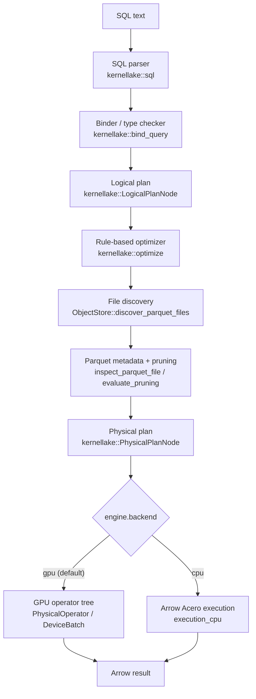
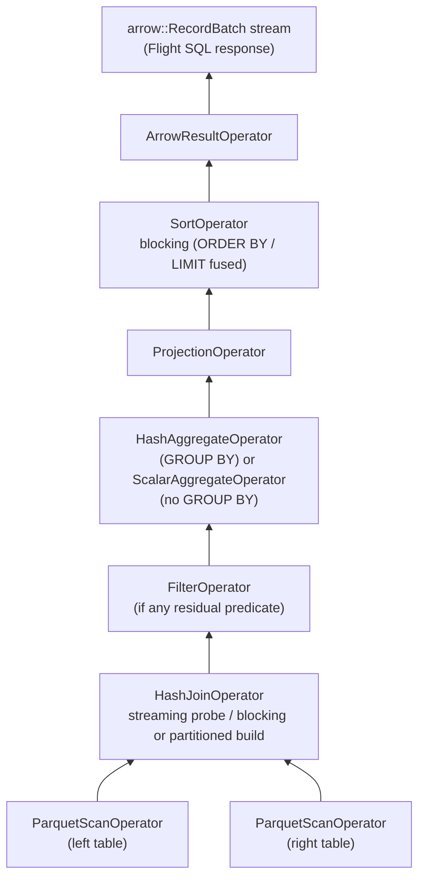

# KernelLake architecture

KernelLake is a compute and query layer over Apache Iceberg/Parquet data
lakes: it executes analytical SQL using Apache Arrow-compatible columnar
data as its in-memory representation and NVIDIA GPUs for accelerated
execution. It is not a storage database.

## Pipeline

```
SQL text
  -> SQL parser              (kernellake::sql)
  -> binder / type checker   (kernellake::bind_query)
  -> logical plan            (kernellake::LogicalPlanNode)
  -> rule-based optimizer    (kernellake::optimize)
  -> file discovery          (kernellake::ObjectStore, discover_parquet_files)
  -> Parquet metadata + pruning (kernellake::inspect_parquet_file, evaluate_pruning)
  -> physical plan           (kernellake::PhysicalPlanNode, build_physical_plan)
  -> GPU execution           (kernellake::PhysicalOperator / DeviceBatch, kernellake_execution_gpu)
  -> Arrow result
```

Every stage is implemented and covered by tests: parsing through physical
planning by `tests/unit/`, GPU execution by `tests/gpu/` (see "CPU/GPU build
split" below for why GPU execution lives in a separate test binary and
CMake preset rather than `tests/unit/`).



Everything through the physical plan is backend-agnostic; only the last
stage forks on `engine.backend` (see "CPU/GPU build split" below).

## Module layout

| Module | Contents |
| --- | --- |
| `common` | Error hierarchy, identifiers, config loading, logging, date parsing, shared curl HTTP-client helpers (`http_client.hpp`, used by both `iceberg` and `unitycatalog`) |
| `types` | Internal `TypeId`/`DataType`/`Schema`, Arrow adapters |
| `expression` | Typed expression tree (`Expression` and subclasses) |
| `sql` | Parser-independent AST (`kernellake::sql::AstSelectStatement`) and the parser adapter around the vendored `hyrise/sql-parser` |
| `planner` | Binder, logical plan + logical planner, physical plan node definitions |
| `optimizer` | Rule-based logical plan rewriting |
| `storage` | `ObjectStore`/`LocalObjectStore`/cloud backends (S3/GCS/Azure/HDFS), file discovery |
| `iceberg` | Iceberg REST catalog client, manifest reading, partition pruning, position-delete reads, schema translation (`kernellake_iceberg`) |
| `delta` | Delta Lake read support (`kernellake_delta`) |
| `unitycatalog` | Unity Catalog client (auth, table lookup, temporary S3/GCS/Azure credentials) and the resolver that dispatches a UC-managed table to `iceberg`/`delta`/plain-Parquet resolution (`kernellake_unitycatalog`) |
| `io` | Parquet metadata inspection, row-group pruning, the physical planner (ties `planner` + `storage` + `io` together) |
| `memory` | RAII CUDA device/stream wrappers, RMM memory-pool/statistics/limit configuration (`gpu-dev` preset only) |
| `execution_gpu` | `PhysicalOperator`/`DeviceBatch`/`ExecutionContext`, the Arrow<->cudf bridge, the AST expression compiler, and every concrete GPU operator (`gpu-dev` preset only) -- renamed from `execution` |
| `execution_cpu` | The CPU (Arrow Acero) execution backend (`kernellake_execution_cpu`) -- every preset, not `gpu-dev`-only |
| `observability` | OpenTelemetry tracing/metrics/logging wiring (`kernellake_observability`, see `docs/OBSERVABILITY.md`) |
| `server` | `kernellake-server`, Flight SQL, `GpuExecutionCoordinator` (`kernellake_flight_sql_server`, `KERNELLAKE_BUILD_SERVER` only) |
| `generator` | `kernellake generate-data`'s deterministic synthetic dataset generator (CPU-only, no CUDA dependency) |
| `api` | `QueryEngine`, the top-level entry point |
| `cli` | The `kernellake` executable and its subcommands |

Dependency direction: `storage` has no dependency on `planner`; `planner`
depends on `storage` only for the `Uri` type used in scan fragments; `io`
depends on both `planner` and `storage`. This keeps the object-store
abstraction independent of the query compiler while letting the physical
planner (which lives in `io`) consume both.

## Why the SQL parser needs a `read_parquet(...)` adapter

KernelLake vendors `hyrise/sql-parser` (MIT license, pinned commit) via
CMake `FetchContent` rather than hand-writing a parser. That grammar's
`FROM` clause accepts table names, joins, and subqueries -- but has no
table-valued-function syntax. `kernellake::sql::parse_sql()` therefore
finds every occurrence of `read_parquet('path' [, 'path2', ...])`,
`read_iceberg('catalog.namespace.table')`, `read_delta('table_uri')`, or
`read_unity_catalog('instance.catalog.schema.table')` in the query text,
extracts each one's path/identifier arguments, and
substitutes a distinct placeholder identifier for each occurrence, leaving
the surrounding syntax (`JOIN`/`ON`/aliases/commas) completely untouched --
hsql's own grammar still parses the real table-reference/join structure
around those placeholders. This scan is hand-rolled rather than
`std::regex`-based: an earlier `std::regex` implementation recursed once
per repetition of a `(...)*` group and could stack-overflow on pathological
input (see `src/sql/parser.cpp`'s own comments for the detail). `parse_sql()`
then walks the resulting `fromTable` and accepts either a single placeholder
(the single-table MVP case) or a chain of `INNER JOIN ... ON` steps between
placeholders, up to `kMaxJoinSources = 12` sources, each aliased (see "Hash
joins" below for the N-way generalization); anything else (a real table
name, a subquery, `LEFT`/`RIGHT`/`FULL`/`CROSS` JOIN, a comma-style join,
or more than 12 sources) fails with a clear `SqlError` rather than being
silently reinterpreted. This is a narrow, deliberately limited syntax
adapter, not general SQL-string rewriting -- optimizer rules always operate
on the structured plan/expression trees, never on SQL text.

## Supported SQL grammar (current)

```
SELECT <items> FROM read_parquet('path' [, 'path2', ...])
  [WHERE <expr>] [GROUP BY <cols>] [ORDER BY <cols>] [LIMIT <n>]

SELECT <items> FROM read_parquet(...) AS a [INNER | LEFT [OUTER]] JOIN read_parquet(...) AS b
    ON <a.col = b.col> [AND <predicate over b's own columns only>]
  [WHERE <expr>] [GROUP BY <cols>] [ORDER BY <cols>] [LIMIT <n>]

SELECT <items> FROM (SELECT ...) AS alias
  [WHERE <expr>] [GROUP BY <cols>] [ORDER BY <cols>] [LIMIT <n>]
```

`read_parquet(...)` may be replaced by `read_iceberg('catalog.namespace.table')`,
`read_delta('table_uri')`, or `read_unity_catalog('instance.catalog.schema.table')`
in either shape above, and mixed freely across sources within one join
chain. `read_unity_catalog(...)` is a name/permission/credential broker,
not a fourth storage format of its own -- it authenticates to a configured
Unity Catalog instance, looks up the table's actual format and storage
location, and dispatches to whichever of the other three paths matches
(`DELTA`/`PARQUET` via a short-lived, Unity-Catalog-vended S3/GCS/Azure
credential, dispatched by the storage location's own URI scheme
(`s3`/`gs`,`gcs`/`abfs`,`abfss`,`az`); `ICEBERG` via Unity Catalog's own
Iceberg-REST-compatible endpoint, reusing the same
`IcebergRestCatalogClient` a plain `read_iceberg(...)` uses) -- see
`kernellake::unitycatalog::UnityCatalogSourceResolver`
(`src/unitycatalog/unity_catalog_source_resolver.cpp`) and
`docs/ROADMAP.md`'s Unity Catalog entry for the full scope and what's
still deferred (catalog/schema `LIST` operations have no SQL surface;
only the AWS `aws_temp_credentials` vended-credential shape has been
verified against a real live server, the GCS/Azure shapes are
parsing-tested only; `UnityCatalogClient` itself is still constructed
fresh per `resolve()` call, since `get_table()`/`list_*()` must always
reflect current catalog state -- only its OAuth2 *token* is shared across
calls and queries, via a `UnityCatalogTokenCache` `QueryEngine` owns and
hands to every resolver it constructs). Vended credentials are used at
both *resolve* time (schema discovery, physical planning) and actual scan
*execution*: `ResolvedTable::owned_store` carries the resolver's
temporary `S3ObjectStore`/`GcsObjectStore`/`AzureObjectStore` (when one
was built) onto the `ParquetScanNode` it produces
(`ParquetScanNode::owned_store()`), and both scan-execution backends pick
it per scan node -- `acero_query_executor.cpp`'s `translate()` (CPU) and
`operator_builder.cpp`'s `build()` (GPU) -- instead of assuming the one
`ObjectStore` threaded through the rest of the physical plan tree is
always the right one for every scan. Confirmed against a real live Unity
Catalog server and a real MinIO, not just reasoned about: see
`docs/ROADMAP.md`'s "Unity Catalog: scan-execution credentials" entry.

- Column references, aliases, `*`
- Numeric, string, boolean, date (`DATE 'YYYY-MM-DD'`), and `NULL` literals
- Arithmetic (`+ - * /`), comparisons, `AND`/`OR`/`NOT`, `BETWEEN`,
  `IS [NOT] NULL`
- `LIKE`/`NOT LIKE` (SQL `%`/`_` wildcards). Both backends support it
  everywhere now (`WHERE`, `SELECT` list, a `CASE` branch, and both grouped
  and scalar aggregate arguments -- e.g. TPC-H Q14's `SUM(CASE WHEN p_type
  LIKE 'PROMO%' THEN ... ELSE ... END)`), via `cudf::strings::like()` (GPU)
  or Arrow Compute's own `match_like` kernel (CPU) -- see "LIKE/IN/CASE/CAST
  implementation notes" below
- `IN (literal, ...)`/`NOT IN (...)` (desugared at bind time into an
  equivalent `OR`/`AND` chain of equality comparisons -- no new GPU
  execution support needed) and `IN (SELECT ...)`/`NOT IN (SELECT ...)`,
  a non-correlated multi-row subquery source resolved into the same
  literal-list form before binding -- see "`IN (SELECT ...)` subqueries"
  below
- `CASE WHEN ... THEN ... [WHEN ...] [ELSE ...] END`, both simple
  (`CASE x WHEN ...`) and searched forms. Scope differs by backend: the CPU
  backend supports it everywhere (`WHERE`, `SELECT` list, `GROUP BY` keys,
  and both grouped and scalar aggregate arguments), via Arrow Compute's own
  `case_when` kernel -- one shared expression compiler for every context,
  so all of them work as soon as it does. The GPU backend supports it in
  the `SELECT` list, `GROUP BY` keys, and both grouped and scalar aggregate
  arguments (e.g. `SUM(CASE WHEN ... THEN ... ELSE ... END)`, TPC-H Q12/
  Q14's shape) -- but **not yet in `WHERE`** (a separate, still-open
  `FilterOperator` gap; see "LIKE/IN/CASE/CAST implementation notes" below)
- A `SELECT` item that *combines multiple aggregates arithmetically* (e.g.
  TPC-H Q14's `100.00 * SUM(...) / SUM(...)`, a ratio of two aggregates,
  neither one a bare aggregate call by itself) -- both backends, since this
  is resolved in the shared logical-plan construction step, not per-backend
  execution code; see "Aggregate-combining SELECT items" below
- `CAST(expr AS type)` (`INT`/`BIGINT`/`DOUBLE`/`VARCHAR(n)`/`DECIMAL(p, s)`;
  see "LIKE/IN/CASE/CAST implementation notes" below for the
  truncate-vs-round caveat on numeric-to-integer casts, and "DECIMAL
  support" below for `DECIMAL`'s own scope)
- `DECIMAL(p, s)` columns and literals -- see "DECIMAL support" below
- Aggregates: `SUM`, `COUNT`, `COUNT(*)`, `MIN`, `MAX`, `AVG` (`AVG` does
  not support a `DECIMAL` argument; see "DECIMAL support")
- A chain of two or more tables via `INNER` or `LEFT [OUTER] JOIN ... ON`,
  each step a single equality key plus, optionally, an extra predicate
  scoped to just the newly-joined side (see "Hash joins" below for the
  full scope, including the N-way generalization)
- A single derived table (`FROM (SELECT ...) AS alias`) as a query's
  entire FROM clause -- not itself joined or joinable, not correlated
  (see "Derived tables" below)
- `EXTRACT(field FROM expr)`, `field` one of `YEAR`/`MONTH`/`DAY` only --
  `expr` must be `DATE`/`TIMESTAMP`. `HOUR`/`MINUTE`/`SECOND` are rejected
  outright, not just unimplemented: no generated table has a time-of-day
  component (every date column is `DATE`, not `DATETIME`), so those fields
  are structurally meaningless here. Always evaluates to `BIGINT`. Both
  backends, everywhere a `CASE` can appear except `WHERE` (`SELECT` list,
  `GROUP BY` keys, and both grouped and scalar aggregate arguments) --
  `cudf::ast` has no datetime-extraction operator any more than it has a
  `CASE`/`LIKE`-equivalent one, so it's materialized the same way, via
  `cudf::datetime::extract_datetime_component()` outside the AST tree (see
  "LIKE/IN/CASE/CAST implementation notes" below). CPU backend via Arrow
  Compute's `year()`/`month()`/`day()` kernels (which already return
  `BIGINT`, unlike cudf's `INT16`, needing no extra cast on that side).

Not yet supported (fails clearly rather than being silently reinterpreted):
`DISTINCT`, set operations (`UNION`/etc.), `WITH`/CTEs, `OFFSET`, window
functions, `CASE`/`EXTRACT` in `WHERE` (GPU only -- see above), any
function other than the five aggregates and `EXTRACT` above, `EXTRACT`
fields other than `YEAR`/`MONTH`/`DAY`, comma-style joins,
`LEFT`/`RIGHT`/`FULL`/`CROSS` JOIN, subqueries in `FROM` (derived
tables), correlated *scalar* subqueries, and multi-key or non-equality
join conditions. `HAVING` and three narrow subquery forms are now
supported -- see "`HAVING` and scalar subqueries", "`IN (SELECT ...)`
subqueries", and "Correlated subqueries" (`EXISTS`/`NOT EXISTS`) below.

### `HAVING` and scalar subqueries

`HAVING <bool expr>` is accepted on any aggregate query (`GROUP BY` or a
bare aggregate `SELECT` list), following the same binding rules the
`SELECT` list's own aggregate expressions already follow: any combination
of aggregates and `GROUP BY` keys, rejected otherwise via
`references_ungrouped_column()` (the same check `SELECT` items get).
Architecturally it's just a `LogicalFilter` inserted directly on top of
`LogicalAggregate`, between the aggregate and its re-projection --
`FilterNode`/`FilterOperator` on both backends were already fully generic
enough to filter post-aggregation output; this was previously just never
SQL-reachable.

A subquery is accepted as an operand inside `HAVING`'s own boolean
expression (e.g. `HAVING SUM(x) > (SELECT ...)`, TPC-H Q11's shape) or,
separately, as the source of a `WHERE`-clause `IN (SELECT ...)` (see
"`IN (SELECT ...)` subqueries" below). Both forms are **non-correlated**
(bound independently against their own `FROM`/`JOIN` schema only -- no
access to the outer query's tables or aliases). A `HAVING` subquery must
additionally produce **exactly one row, one column** (a true scalar;
`DOUBLE`/`INT64`/`STRING` results only). Anywhere else -- bare in `WHERE`
(not inside `IN`), `SELECT`, `FROM`, `GROUP BY`, join `ON` -- a subquery
is still rejected with a clear `BindingError`
(`Binder::bind_node(const sql::AstSubquery&, bool)`). `EXISTS`/`NOT
EXISTS` is supported within a narrower, specifically-correlated scope --
see "Correlated subqueries" below -- anything outside that scope hits
the same `BindingError` path via `Binder::bind_node(const
sql::AstExists&, bool)`.

Implementation: `sql::resolve_subqueries()` (a pure, storage-independent
AST tree walker) runs once, in `QueryEngine::plan_logical()`, before the
outer query is ever bound -- it replaces each `AstSubquery` node inside
`having` with a literal by calling
`QueryEngine::evaluate_scalar_subquery()`, which runs the subquery as its
own fully independent bind -> plan -> optimize -> physical-plan -> execute
cycle (recursively resolving any subquery *of its own* first, `having`
and `where` both) and converts the resulting one-row, one-column Arrow
scalar into an AST literal. This subquery execution **always uses the CPU
(Acero) backend**, regardless of the outer query's own `--backend` --
nesting a second `RmmEnvironment`/GPU-execution lifecycle inside
`plan_logical()` risks the same "two `RmmEnvironment`s racing the one
process-wide current-device-resource slot" hazard the Concurrency notes
below already warn about elsewhere, and a scalar subquery's result is one
value, not worth that risk. Because the binder has no I/O capability of
its own (by design -- see `ast.hpp`'s own header comment), this
resolution step could not live in the binder itself; it needed a layer
with real query-execution access, which only `QueryEngine` has.

`QueryEngine::run_subquery()` (shared by `evaluate_scalar_subquery()` and
`evaluate_list_subquery()` below) delegates the subquery's own planning
straight to `plan_logical_unoptimized()` -- the same recursive planner a
real top-level query already goes through -- rather than reimplementing
a narrower version of it. **Fixed 2026-08-24**: it previously hand-rolled
its own join-or-single-table-only planning, with no case at all for a
subquery whose own `FROM` is a derived table -- silently falling through
to the single-table branch with an *empty* path list, "no data source
given" at execution time. This mattered for real: TPC-H Q15's own
`HAVING total_revenue = (SELECT MAX(total_revenue) FROM (SELECT ...
GROUP BY l_suppkey) AS r2)` needs exactly this shape (a "max of grouped
sums" can't be expressed without an inner `GROUP BY` feeding an outer
`MAX(...)`, i.e. a derived table). Delegating to
`plan_logical_unoptimized()` fixed it in one place for every subquery
kind at once, and is also a net simplification -- that function already
does its own recursive `HAVING`/`WHERE`-`IN`/`EXISTS` resolution, so
`run_subquery()`'s own manual pre-resolution of those became dead code
and was deleted alongside the fix.

**Real, investigated limitation this surfaced (not yet fixed): an exact
`=`/`<>` comparison between a `HAVING`/`IN` subquery's own result and an
outer aggregate is unreliable when the outer query runs on the GPU
backend.** Since the subquery always executes on CPU (the design
decision explained above) while the outer query's own aggregate executes
on whichever backend `--backend` selects, a `HAVING x = (SELECT
MAX(x) FROM ...)`-shaped comparison ends up checking a GPU-computed
floating-point sum against a CPU-computed one -- and this project's
monetary columns are `DOUBLE`, not `DECIMAL` (see `generate_tpch.py`'s
own docstring), so GPU and CPU floating-point summation essentially
never round to the exact same last bit. TPC-H Q15 is the first query to
combine an exact-equality `HAVING` comparison with its own aggregate this
way, and empirically confirms it: CPU backend is reliable (0/20 repeated
runs mismatched); GPU backend is not (14/20 mismatched, sometimes
returning zero rows instead of the one true match -- GPU hash-based
multi-group aggregation also has its own run-to-run non-determinism on
top of the cross-backend gap, confirmed by isolating a single-group
aggregate, which *was* stable run-to-run on each backend individually).
Investigated a real fix rather than assuming one away: `QueryEngine::
execute(sql)`'s own convenience wrapper calls `plan_logical()` (which is
where subquery resolution happens) *before* constructing its own
`RmmEnvironment`, so a subquery *could* safely build a temporary GPU
`RmmEnvironment` sequentially, with no lifetime overlap, for that single-
query-per-process caller specifically. But `run_subquery()` is shared
code, also reached via `explain()` -- and the Flight SQL server's
`GpuExecutionCoordinator` can plan *multiple concurrent requests* against
one shared `QueryEngine` instance (see "Concurrency" below), each
potentially triggering subquery resolution at the same time. Since
`RmmEnvironment`'s constructor installs itself as the *process-wide*
current CUDA device memory resource, letting subqueries build their own
GPU `RmmEnvironment` unconditionally would reintroduce exactly the
racing-`RmmEnvironment`s hazard this design already avoids elsewhere --
a real fix needs an externally-owned, safely-shared `RmmEnvironment`
threaded all the way into planning, not a quick change to
`run_subquery()` alone. Until that exists, TPC-H Q15 is documented as
CPU-backend-only (see its own query file's header comment) rather than
shipped with a silently-unreliable GPU result.

### `IN (SELECT ...)` subqueries

`value IN (SELECT ...)` (and `NOT IN`) is accepted in `WHERE`, with the
subquery as the IN list's source instead of a literal list -- TPC-H
Q18's shape (`o_orderkey IN (SELECT l_orderkey FROM lineitem GROUP BY
l_orderkey HAVING SUM(l_quantity) > 300)`). The subquery must be
**non-correlated** (same rule as a `HAVING` subquery) but, unlike
`HAVING`'s exactly-one-row contract, may return **any number of rows, one
column** (`DOUBLE`/`INT64`/`STRING`).

Implementation: `AstIn` gained a `subquery` field (`std::shared_ptr<
AstSelectStatement>`, mutually exclusive with its existing `list` field)
populated by `convert_in()` (`parser.cpp`) when `IN`'s operand is a
subquery rather than a literal list -- hsql already parses this shape
(the same `select` field `kExprSelect` uses), so no grammar work was
needed, only accepting what was previously an explicit rejection.
`sql::resolve_in_subqueries()` (a sibling to `resolve_subqueries()`, kept
separate rather than generalizing it, since `HAVING` must keep its
exactly-one-row contract unchanged) walks `WHERE`, replacing each
matched `AstIn`'s `subquery` with a literal `list` via
`QueryEngine::evaluate_list_subquery()` -- the same generic bind -> plan
-> optimize -> physical-plan -> execute pipeline `evaluate_scalar_subquery()`
uses (factored into a shared `QueryEngine::run_subquery()`), just without
the row-count assertion, looping over every row instead of extracting
one. By the time `bind_node(const AstIn&, bool)` (`binder.cpp`) runs,
`subquery` is always null and `list` is always populated (or the whole
`AstIn` node was replaced by a boolean literal, see below) --
indistinguishable from an `IN` whose source was always a literal list, so
the binder needed no changes at all. The resulting literal list is
desugared into an `OR`-chain of equality comparisons exactly the way a
literal `IN (1, 2, 3)` already is (see `IN (literal, ...)` above) -- a
deliberately narrow mechanism for a subquery expected to return a modest
number of rows (Q18's own `SUM(l_quantity) > 300` filter is tight even at
large scale factors), not a general-purpose semi-join; there is no size
cap, so a subquery returning a very large number of rows would build a
correspondingly large expression tree rather than failing loudly.

An empty subquery result is handled as standard SQL semantics require --
`x IN ()` is always false and `x NOT IN ()` is always true, regardless of
`x` -- by replacing the whole `AstIn` node with a boolean literal
directly (`resolve_in_subqueries()`'s own empty-list branch) rather than
reaching `bind_node`'s pre-existing "IN requires at least one value"
check, which is about a malformed literal list, not a legitimately empty
subquery result.

`GROUP BY <name>` resolves `<name>` against the base-table schema first,
then falls back to matching a `SELECT`-list output alias -- this is what
lets you `GROUP BY` a computed expression like `CASE ... AS bucket` or
`EXTRACT(YEAR FROM ...) AS y` (neither has a column name of its own):
`SELECT CASE ... AS bucket, COUNT(*) FROM ... GROUP BY bucket` groups by
the alias, not a base column named `bucket`. If both exist, the base
column wins (standard SQL alias-shadowing behavior). The alias-defining
`SELECT` item is exempted from the ungrouped-column check that normally
rejects non-aggregated, non-grouped-by expressions in an aggregate
query's `SELECT` list. On the CPU (Acero) backend, a computed `GROUP BY`
key is projected under its own logical alias name (not a throwaway
synthetic one) before the aggregate node, so the projected column's name
still matches `HashAggregateNode::output_schema()`'s own field name --
Acero's `AggregateNodeOptions::keys` has no separate output-name mechanism
the way each `Aggregate`'s own `output_name` does, unlike an aggregate
*argument*'s projected name, which is a pure implementation detail.

`ORDER BY` executes for real via `SortOperator` (`cudf::stable_sorted_order`
+ `cudf::gather`, blocking -- it consumes the whole input before producing
its one output batch, so its memory footprint is the whole result set, not
bounded like the streaming operators). On a non-aggregate query it can
reference any column, bound against the base-table schema. After `GROUP
BY` it is scoped to a plain SELECT-list output name (e.g. `ORDER BY total`)
-- resolved against the query's final output schema rather than the base
table, since an aggregate alias doesn't exist as a column until after
aggregation -- not an arbitrary re-derived expression; `ORDER BY
<expression not in the SELECT list>` after `GROUP BY` fails with a clear
`BindingError` rather than being silently reinterpreted.

## Logical plan and the optimizer

Logical plan nodes: `LogicalScan`, `LogicalJoin`, `LogicalFilter`,
`LogicalProjection`, `LogicalAggregate`, `LogicalSort`, `LogicalLimit`.
`LogicalJoin` is the only binary node (see "Hash joins" above); every other
node, including `LogicalScan`, is a leaf or unary. `LogicalScan` always
starts with every column and predicate the schema/query could reference;
`kernellake::optimize()` then:

- folds constants and simplifies boolean expressions bottom-up
- rewrites `BETWEEN a AND b` into `(>= a) AND (<= b)`
- combines adjacent filters and removes filters that fold to `TRUE`
  (a filter that folds to `FALSE` is kept but annotated
  `estimated_rows = 0`, since there is no dedicated empty-result plan node)
- removes an identity `LogicalProjection` (one that just passes its child's
  columns through unchanged)
- pushes `LIMIT` down through any chain of pass-through projections
- annotates `LogicalScan::required_columns()` with the minimal column set
  the plan actually references, **without** reindexing the scan's schema or
  the expressions above it -- narrowing column *positions* would require
  rewriting every `ColumnExpression` in the tree. Instead the physical
  planner (in `io`) builds the narrowed physical schema and column list
  when it converts `LogicalScan` into `ParquetScanNode`, which is the
  natural point where physical batch layout is decided anyway.
- annotates `LogicalScan::pushable_predicates()` with `column OP literal`
  conjuncts extracted from the `WHERE` clause, for Parquet pruning to
  consume without re-walking the filter expression tree

An aggregate query's `LogicalAggregate` always emits columns in
`[group_by..., aggregates...]` order; a `LogicalProjection` is added on top
to reorder/rename to whatever order the `SELECT` list actually requested
(removed by the redundant-projection rule when it happens to already match).

## Parquet metadata, pruning, and the physical plan

`inspect_parquet_file()` reads a file's footer (schema, row count, row
groups, per-row-group column statistics) without decoding any column data.
`evaluate_pruning()` compares `LogicalScan::pushable_predicates()` against
each row group's min/max statistics and only ever skips a row group when a
predicate is *proven* impossible to satisfy -- missing, partial, or
type-incomparable statistics always fall back to "must scan". Correctness
takes priority over aggressive pruning; see `ScanDecision::reasons` for the
human-readable explanation of every skip.

`build_physical_plan()` (in `io/physical_planner.cpp`) resolves a
`LogicalScan`'s source-path specs into concrete files via `ObjectStore`,
inspects and prunes each one, and maps every other logical node onto its
physical equivalent (`LogicalAggregate` becomes `HashAggregate` when it has
a `GROUP BY`, or `ScalarAggregate` when it does not; `LogicalSort` becomes
`SortNode`, see `SortOperator` below), always wrapping the result in
`ArrowResultNode`.

## CPU/GPU build split

`KERNELLAKE_WITH_CUDA` (off by default) gates everything that needs CUDA,
libcudf, and RMM: `DeviceBatch` (the GPU-resident batch wrapping
`cudf::table`), `ExecutionContext`, the `PhysicalOperator` streaming
interface, and the concrete GPU operators (`kernellake_execution_gpu`,
`kernellake_memory`; see `tests/gpu/`). This gate is about the GPU path
specifically, not about whether queries can execute at all on a CPU-only
build -- see "CPU execution backend" below for the real, always-available
CPU path (`kernellake_execution_cpu`), which needs none of this.

`QueryEngine::execute()` is built from one of two mutually exclusive
translation units selected by a CMake generator expression on
`KERNELLAKE_WITH_CUDA` (`src/api/query_engine_execute_gpu.cpp` vs.
`_stub.cpp`), plus a third, **always-built** translation unit
(`query_engine_execute_cpu.cpp`) providing `execute_cpu()`. The GPU build's
`execute(sql)` runs the real GPU operator pipeline by default
(`kernellake/execution_gpu/operator_builder.hpp` turns a `PhysicalPlanPtr` into
a `PhysicalOperator` tree, pulled to exhaustion inside
`RmmEnvironment::track_query()` for per-query memory accounting, with each
resulting `DeviceBatch` converted to an Arrow `RecordBatch` via
`kernellake/execution_gpu/arrow_bridge.hpp`); the CPU-only `cpu-dev` preset's stub
throws a clear `ExecutionError` instead -- **unless** `engine.backend` (or
`kernellake query --backend`) is set to `"cpu"`, in which case both builds
instead dispatch to `execute_cpu()`. The `kernellake query` CLI command
(`src/cli/query_command.cpp`) is unconditionally built and calls
`QueryEngine::execute()`, so which of these three paths actually runs
depends on both which preset built it and the `backend` setting.

Everything else in this document (parsing through physical planning and
pruning), plus `kernellake generate-data`, is CPU-only and builds/tests
with the `cpu-dev` CMake preset alone.

### Concurrency: `RmmEnvironment`'s lifetime and the split execution API

`QueryEngine::execute(std::string_view sql)` is a convenience wrapper: it
plans, constructs its own `RmmEnvironment` (installing itself as the
process's current CUDA device memory resource for the call's duration),
executes, and tears that `RmmEnvironment` down again -- all inside one
call. This is correct for a one-query-per-process model (the CLI) but not
for a long-lived process serving many requests: two threads racing
`RmmEnvironment` construction/destruction against the single process-wide
current-device-resource slot is a real use-after-free risk (the same bug
*class*, for a different trigger, as the sequential-test-runs race already
found and fixed -- see "Done" in `docs/ROADMAP.md`), and rebuilding an
entire RMM pool per request is wasteful even single-threaded.

For that reason `QueryEngine` also exposes a split entry point:
`explain(sql) -> PhysicalPlanPtr` (already reentrant -- parsing, binding,
logical planning, optimization, and Parquet metadata inspection touch no
shared mutable state -- with one exception: if the query has a `HAVING`
subquery or a `WHERE ... IN (SELECT ...)` subquery, planning now really
executes it, on the CPU backend, as a side effect of `plan_logical()`;
see "`HAVING` and scalar subqueries"/"`IN (SELECT ...)` subqueries"
above. This is not a new risk category, though -- `explain()` already
performs real Parquet-metadata I/O during planning regardless) followed
by
`execute(const PhysicalPlanPtr&, RmmEnvironment&) -> QueryResult`, which
takes an **externally owned** `RmmEnvironment` instead of building its own.
A long-lived caller should construct exactly one `RmmEnvironment` at
startup and reuse it across every request. `GpuExecutionCoordinator`
(`kernellake/server/`) is that caller for the Flight SQL server: it bounds
concurrent calls to this split `execute()` via a semaphore
(`EngineSection::max_concurrent_gpu_queries`, default 2) rather than the
single-flight mutex this used to be -- see
`docs/GPU_OPTIMIZATIONS.md`'s "Opt #2 implemented" section for why bounded
rather than unbounded (real memory-budget oversubscription and GPU
decode-contention risks, not just an arbitrary cap), and
`RmmEnvironment::make_query_tracker()`/`QueryMemoryTracker`
(`kernellake/memory/`) for how each concurrent call gets its own isolated
memory-usage reporting layered over the same shared, thread-safe limiter.
`execute(sql)` itself is implemented in terms of this split pair -- it is
not two independent code paths to keep in sync.

The split entry point cannot honestly populate
`QueryResult::metadata_inspection_seconds` (planning already happened
before it was called, in whatever produced the `PhysicalPlanPtr`) -- it
stays `nullopt` there, matching the "documented null, never an invented
measurement" rule. `execute(sql)` measures it itself around its own
`explain()`-equivalent call.

### Real-time instrumentation: `MetricsRegistry` and NVTX

Every node `operator_builder.cpp`'s `build_operator_tree()` returns is
wrapped in `InstrumentedOperator`, a generic decorator that times each
`next()` call and (when `ExecutionContext::metrics` is non-null) records it
into a `MetricsRegistry` keyed by `PhysicalOperator::name()` -- no
individual operator implements its own timing. Recorded totals are
*inclusive* of children (a parent's `next()` call naturally invokes its
already-separately-instrumented child's `next()` internally), so only a
leaf operator's (e.g. `ParquetScanOperator`'s) total is true self time.
`QueryResult::parquet_decoding_seconds` does **not** use that plain
`next()`-call self time, though: since `ParquetScanOperator`'s decode/
compute overlap (see that operator's own class comment) moves most of its
real decode cost onto a background thread *between* `next()` calls, the
plain self-time under-reports it for the common (non-partitioned) scan
path. `InstrumentedOperator` separately records the operator's own
`resource_seconds()` -- real cumulative time inside every
`reader_->read_chunk()` call, regardless of which thread/path made it --
under a derived `"{node_name()}.resource_seconds"` metrics key, and
`query_engine_execute_gpu.cpp` reads `parquet_decoding_seconds` from that
key instead.
`QueryResult::gpu_execution_seconds`/`device_to_host_seconds` are measured
independently as plain wrapping timers around the operator-tree pull loop
and each `to_arrow_record_batch()` call, respectively, rather than via the
registry -- there is no meaningful "device to host" or "whole tree"
*operator* to attribute those to.

`QueryResult::host_to_device_seconds` stays `nullopt`: there is no separate
host-to-device transfer phase to time in the current architecture (cudf's
chunked Parquet reader decodes host file bytes directly into device memory
in one call), not a gap that was simply missed.

`ProfilingSection::nvtx` (in `EngineConfig`) makes the same
`InstrumentedOperator` wrapper additionally emit an `nvtx3::scoped_range`
per `next()` call, visible in `nsys`/Nsight Systems timelines -- one
instrumentation point serves both the internal `MetricsRegistry` and
external NVTX profiling.

### GPU operators

`build_operator_tree()` (`operator_builder.cpp`) walks the physical plan
top-down and instantiates one concrete operator per node, bottom-up in the
`std::unique_ptr` chain each one owns as its `child`. A representative
TPC-H-shaped query (two-table join, `GROUP BY`, `ORDER BY ... LIMIT`) looks
like this, data flowing upward from the two scans:



Every operator is also wrapped in `InstrumentedOperator` (not shown above),
which records per-`next()` wall-clock time into `MetricsRegistry` and emits
an NVTX range, so the same tree shape shows up directly in a trace tool.
Most operators are **streaming** (bounded memory, one batch of `child` in
flight at a time); `SortOperator` and a non-partitioned `HashJoinOperator`
build side are **blocking** (consume `child` to exhaustion first) -- see
each operator's own row in the table below for which.

| Operator | Notes |
| --- | --- |
| `ParquetScanOperator` | `cudf::io::chunked_parquet_reader`, bounded by `pass_read_limit_bytes` (not row count) |
| `FilterOperator` | `cudf::compute_column` + `cudf::apply_boolean_mask` over a compiled AST predicate |
| `ProjectionOperator` | Compiled AST per computed item; a bare column reference is copied directly instead (see below) |
| `ScalarAggregateOperator` | No `GROUP BY`: `cudf::reduce` with its `init` parameter folds each batch into a running scalar (SUM/MIN/MAX/AVG numerator); COUNT/AVG's denominator is a host-side counter. Empty input produces NULL, not zero, except `COUNT(*)`/`COUNT(x)` which produce 0. |
| `HashAggregateOperator` | `GROUP BY`: each incoming batch is aggregated on its own with a plain, one-shot `cudf::groupby::groupby`, then folded into a running partial result (concatenate + re-aggregate) -- not `cudf::groupby::streaming_groupby` (replaced: that design coupled `max_distinct_keys` to an unrelated per-call row-count limit, causing severe slowdowns on low-cardinality GROUP BYs over large scans). `accumulated_` exceeding `max_distinct_keys` (default 75M, config-driven via
`engine.max_distinct_keys` in `kernellake.yaml`) throws. |
| `LimitOperator` | `cudf::slice` + the `cudf::table` copy constructor to truncate the final batch |
| `SortOperator` | `ORDER BY`: **blocking**, unlike every operator above -- consumes `child` to exhaustion, concatenates every batch (`cudf::concatenate`) into one table, then `cudf::stable_sorted_order` + `cudf::gather`. Memory footprint is the whole result set, not bounded like the streaming operators. |
| `HashJoinOperator` | Two-table `INNER JOIN`: when `choose_partition_count()` decides the build side is small enough, its *build* (right) side is **blocking** like `SortOperator` (consumed to exhaustion, concatenated into one table, then wraps a single `cudf::hash_join`); otherwise both sides are grace-hash partitioned and spilled to disk, bounding device memory to one partition/batch at a time (`b915063`, 2026-08-13). Its *probe* (left) side streams normally, one `inner_join()` + double-`cudf::gather` per batch (unpartitioned case). See "Hash joins" above. |
| `SemiAntiJoinOperator` | `LEFT SEMI`/`LEFT ANTI`, produced only by the `EXISTS`/`NOT EXISTS` rewrite: its *build* (right) side is **blocking**, same shape as `HashJoinOperator`'s unpartitioned build (no partitioned mode yet). Its *probe* (left) side streams normally, wrapping the same `cudf::hash_join` -- `LEFT SEMI` via `inner_join()` + `cudf::distinct()` dedup, `LEFT ANTI` via `left_join()` filtered to the `JoinNoMatch` sentinel -- gathering only *its own* columns, never the build side's. See "Correlated subqueries" above. |
| `ArrowResultOperator` | Trivial passthrough; the actual `DeviceBatch` -> `arrow::RecordBatch` conversion happens in `QueryEngine::execute()` via `to_arrow_record_batch()`, since `PhysicalOperator::next()` must return a `DeviceBatch` |

Two correctness details worth knowing if you touch these operators:

- **Plain column references never go through `cudf::ast::compute_column`.**
  cudf's AST evaluator can only materialize fixed-width output columns, so
  routing a bare STRING column reference through it (e.g. `GROUP BY region`,
  or `SELECT region`) aborts with "Invalid, non-fixed-width type" even
  though no computation was requested. `ProjectionOperator`,
  `HashAggregateOperator` (group-by keys and `COUNT(*)`'s materialized
  argument), and `ScalarAggregateOperator` (aggregate arguments) all detect
  a plain `ColumnExpression` and copy that column directly instead.
- **The physical planner remaps `ColumnExpression` indices above the scan.**
  The binder resolves every column reference against the query's one full
  (unpruned) schema; `build_physical_plan()`'s `convert_scan()` then
  narrows the *physical* scan to only the columns actually referenced,
  which shifts column positions whenever a non-trailing column is dropped.
  `physical_planner.cpp`'s `remap_columns()`/`remap_named()` rewrite every
  filter predicate, projection item, and aggregate/group-by expression
  above the scan to the narrowed schema's actual layout -- without this, a
  query like `SELECT SUM(amount) ...` (where an earlier column got pruned
  away) would index past the end of the batch the scan operator actually
  produces.
- **`HashAggregateOperator` never uses `cudf::groupby`'s native COUNT/MEAN
  aggregations.** `COUNT`/`COUNT(*)`/`AVG` are instead computed as a `SUM`
  over a synthesized `INT64` "ones"/value column -- cudf's own COUNT and
  MEAN groupby aggregations both accumulate through a 32-bit
  `cudf::size_type` internally and silently wrap around once a single
  group's row count exceeds `INT32_MAX`, confirmed by a real SF1000
  TPC-H Q1 run (see `docs/ROADMAP.md`). `SUM`/`MIN`/`MAX` are the only
  aggregate kinds that still go through cudf's native groupby
  aggregations directly. `ScalarAggregateOperator` doesn't have this
  problem -- `cudf::reduce` honors the requested output type for `COUNT`
  and has no such internal accumulator-width limit.
- **`LogicalProjection`/`LogicalSort` conversion must not always remap
  against the scan.** Most physical nodes (`Filter`, `Aggregate`) sit at a
  fixed structural position, always directly above the scan, so their
  expressions always reference the base-table schema and always need
  `remap_columns()`. `Projection` and `Sort` are different: each can sit
  either directly on `Filter`/`Scan` (references the base-table schema,
  needs remapping) *or* directly on `Aggregate` (its reprojection's/sort
  key's expressions already reference the aggregate's own output schema
  one-for-one, and remapping them against the scan fails outright, since
  an aggregate alias like `total` was never a real scanned column).
  `physical_planner.cpp`'s `convert()` discriminates by checking whether
  the node's child is specifically `LogicalFilter`/`LogicalScan`/
  `LogicalJoin` (a positive match on the case that needs remapping,
  looking through any interposed `LogicalSort`/`LogicalLimit` first --
  see `references_scan_schema()`) rather than checking "child is not
  `LogicalAggregate`" -- the latter looked equivalent but isn't: the
  optimizer's redundant-projection-removal rule can delete an aggregate
  query's reprojection when the SELECT list already matches the
  aggregate's natural column order, which made an earlier, negative-check
  version of this discriminator (checking only for `LogicalProjection`)
  wrongly treat a `Sort` sitting directly on `LogicalAggregate` as if it
  needed scan-schema remapping.

### CPU execution backend (Apache Arrow Acero)

Unlike the GPU path, the CPU backend is not a set of hand-rolled operators
pulled batch-by-batch: `src/execution_cpu/acero_query_executor.cpp`
translates a `PhysicalPlanPtr` directly into an `arrow::acero::Declaration`
tree (Arrow's own CPU-native streaming execution engine) and runs it in one
shot via `arrow::acero::DeclarationToTable()`, which returns an Arrow
`arrow::Table` with no separate device-to-host bridging step needed. This
module (`kernellake_execution_cpu`) is **always built**, in both the `dev`
and `gpu-dev` presets, and depends on nothing CUDA-related -- selecting it
is a runtime choice (`engine.backend: "cpu"`, or `kernellake query --backend
cpu`), not a build-time one, and it works even on the CPU-only `dev` build,
which cannot run the GPU path at all.

**Scope for this phase**, matching the GPU engine's own original MVP order:
`ParquetScan` -> `HashJoin` (a chain of two or more tables, `INNER JOIN`
only, each step a single equality key -- see "Hash joins" below for the
full N-way scope, which applies identically to this backend) -> `Filter`
-> `Projection` (arithmetic/comparisons/`BETWEEN`/`CASE`/`LIKE`) ->
`ScalarAggregate`/`HashAggregate` (`SUM`/`COUNT`/`MIN`/`MAX`/`AVG`, grouping
only by a plain column) -> `Sort` (by a plain column only) -> `Limit`.
`IN`/`CAST`-to-`DECIMAL`-or-`STRING` are not yet supported here --
`compile_expression_cpu()` throws `ExecutionError` naming the specific
unsupported construct rather than silently miscompiling. Arrow Compute's
function registry is actually more complete than `cudf::ast` turned out to
be for some of these (no "cannot output STRING" restriction, for
instance), so extending this list later is likely less work than the GPU
equivalents were -- just not free.

**`LikeExpression` -> Arrow Compute's own `"match_like"` kernel, fixed.**
This backend used to reject `LIKE`/`NOT LIKE` in every context
("unrecognized expression type in CPU expression compiler
(LIKE/IN/CASE/DECIMAL are not yet supported...)"), same as `CASE` (see
just below) -- found together while adding TPC-H Q14, which needs `LIKE`
inside a `CASE` branch inside an aggregate argument. Fixed in
`compile_expression_cpu()` by mapping `LikeExpression` to `"match_like"`:
the SQL-style `%`/`_` wildcard pattern `LikeExpression::pattern()` already
stores needs no conversion, since `MatchSubstringOptions` accepts it
directly; `NOT LIKE` wraps the result in `"invert"`. Since
`compile_expression_cpu()` is the one function shared by every context on
this backend, `WHERE`, `SELECT` list, and `CASE` branches all gained
`LIKE` support from this one change, same as the `CASE` fix below.

**`CaseExpression` -> Arrow Compute's own `"case_when"` kernel, fixed.**
This backend used to reject `CASE` everywhere ("unrecognized expression
type in CPU expression compiler (LIKE/IN/CASE/DECIMAL are not yet
supported...)"), even though the GPU backend already supported it in a
grouped aggregate argument (just not a *scalar* one -- see the GPU-side fix
just below -- or `WHERE`) -- found while scoping TPC-H Q12/Q14, both of
which need `SUM(CASE WHEN ... THEN ... ELSE ... END)`. Fixed in
`compile_expression_cpu()` by mapping `CaseExpression` to `"case_when"`: a
struct of per-branch boolean conditions (built via `"make_struct"`) as the
first argument, followed by one value expression per condition and an
optional trailing value for `CaseExpression::else_branch()` -- a row
matching no condition and no `ELSE` emits `NULL`, exactly `CaseExpression`'s
own documented semantics, so no extra handling was needed for that case.
Since `compile_expression_cpu()` is the one function shared by every
context on this backend (`WHERE`, `SELECT` list, and both grouped and
scalar aggregate arguments), all of them work as soon as this one function
does -- unlike the GPU backend, which is split between an eager
cudf-materializing path (`HashAggregateOperator`/`ScalarAggregateOperator`/
`ProjectionOperator`, each with their own `CASE`-aware `compile_expr()`/
`materialize()`) and a separate lazy `cudf::ast` path (`FilterOperator`,
still not `CASE`-aware). Verified for real: matches DuckDB exactly for
`CASE` in a grouped aggregate, a scalar aggregate, and `WHERE`, all against
real data; a new regression test,
`QueryEngineExecuteCpuTest.CaseInGroupedAggregateWhereAndScalarAggregateMatchesExpectedTotals`;
`dev` (172/172), `server-dev` (175/175), `otel-dev` (175/175) all pass with
zero regressions.

**`ScalarAggregateOperator` gains the same `CASE`-aware compiled-expression
machinery `HashAggregateOperator` already had, fixed (GPU).**
`ScalarAggregateOperator` (the no-`GROUP BY` aggregate path) used to
compile a non-plain-column aggregate argument via the plain `cudf::ast`
`ExpressionCompiler` directly, which has no `CASE` support at all
("unrecognized expression type in GPU expression compiler") -- unlike
`HashAggregateOperator` (the `GROUP BY` path), which already had the
`CASE`-aware `compile_expr()`/`materialize()`/`materialize_case()` fast
paths (see "LIKE/IN/CASE/CAST implementation notes" below). This is exactly
TPC-H Q14's shape: a *scalar* `SUM(CASE WHEN ... THEN ... ELSE ... END)`,
no `GROUP BY`. Fixed by giving `ScalarAggregateOperator` the identical
`CompiledExpr`/`CompiledCase`/`CompiledDecimalCast` structs and
`compile_expr()`/`materialize()`/`materialize_case()` methods
`HashAggregateOperator` already has (duplicated rather than shared, matching
this codebase's existing convention of each GPU operator owning its own
compiled-expression machinery -- see `ProjectionOperator`, which already
duplicated the same pattern independently). This does **not** cover `CASE`
inside `WHERE` (`FilterOperator`'s own, still-open gap; confirmed still
failing after this fix) -- out of scope here since neither Q12 nor Q14's
own `WHERE` clause needs it. Verified for real: matches DuckDB exactly for
a scalar `SUM(CASE ...)`; a new regression test,
`QueryEngineExecuteTest.CaseInScalarAggregateMatchesExpectedTotal`; all 250
`gpu-dev` tests pass (was 249) with zero regressions.

**`LikeExpression` support added to `HashAggregateOperator`,
`ScalarAggregateOperator`, and `ProjectionOperator` (GPU), for `LIKE`
inside a `CASE` branch.** Found while adding TPC-H Q14, which needs `SUM(CASE
WHEN p_type LIKE 'PROMO%' THEN ... ELSE ... END)` -- a `LikeExpression` as a
`CASE` branch's condition, compiled via each operator's own `compile_expr()`/
`compile_value()`, which had no `LikeExpression` case at all (falling
through to the plain `cudf::ast` `ExpressionCompiler`, which has no
LIKE-equivalent operator, same reason `FilterOperator` special-cases
top-level `WHERE` LIKE conjuncts instead of routing them through its own AST
compiler). Fixed by adding an identical `CompiledLike` fast path (mirroring
`CompiledCase`/`CompiledDecimalCast`'s existing pattern) to all three
operators, each materializing via `cudf::strings::like()` directly --
exactly `FilterOperator::evaluate_like()`'s own algorithm, just invoked from
inside a `CASE` branch's evaluation instead of a top-level `WHERE`
conjunct. This does **not** add general `LIKE` support to `WHERE` beyond
what `FilterOperator` already had (that gap remains open, see above) --
only `LIKE` reachable via a `CASE` branch or a plain (non-`CASE`) `GROUP
BY`/aggregate-argument expression. Verified for real: TPC-H Q14's full
shape (join + `CASE` + `LIKE` + two aggregates combined arithmetically --
see the logical-planner fix just below) matches DuckDB exactly on GPU;
`gpu-dev` (251/251, +1) passes with zero regressions.

**A `SELECT` item combining multiple aggregates arithmetically, fixed (both
backends).** `build_logical_plan()` used to only recognize a `SELECT` item
as valid in an aggregate query if it *was* (at the top level) exactly an
`AggregateExpression`, or exactly matched a `GROUP BY` key by `to_string()`
-- anything else threw `"SELECT item '...' is neither an aggregate nor a
GROUP BY column"`, even after the binder had already bound it successfully.
TPC-H Q14's own `SELECT` item is exactly this shape: `100.00 * SUM(CASE
WHEN ... THEN ... ELSE 0 END) / SUM(...)`, a `BinaryExpression` combining
two `AggregateExpression` subtrees arithmetically, neither one bare --
found while adding Q14, *after* the `LIKE`-in-`CASE` fixes above already
made the query's individual pieces work; this was a third, separate gap.
Fixed by `rewrite_aggregate_refs()` in `logical_planner.cpp`: a recursive
rewrite that finds every distinct `AggregateExpression` subtree in a
`SELECT` item (registering each once in `LogicalAggregate`'s output --
deduplicated by `to_string()`, so `SUM(x) / SUM(x)` only computes it once),
replaces it with a `ColumnExpression` pointing at its slot, and similarly
short-circuits (without recursing further) at any subtree matching a
`GROUP BY` key -- essential for `GROUP BY <alias>` resolving to a computed
`SELECT`-list expression whose own internals (e.g. a column reference
inside a `CASE`'s condition) are deliberately exempted from the
ungrouped-column check at bind time specifically because the match happens
at that whole-subtree level, not by decomposing further (see binder.cpp).
A bare top-level aggregate `SELECT` item is special-cased to keep
registering its slot under the query's own alias (e.g. `AS revenue`)
rather than a synthetic name, preserving this project's existing
field-naming convention for the common case; every other (newly
discovered, possibly deeply-nested) aggregate reference gets a synthetic
`__kernellake_agg_N` name instead, since there is no single natural
output name for an aggregate that isn't itself a whole `SELECT` item.
This fix lives in shared, backend-agnostic logical-plan-construction code,
not per-backend execution code, so it applies to both the CPU and GPU
backends at once. Verified for real: TPC-H Q14's full shape matches
DuckDB exactly on *both* backends; two new regression tests,
`LogicalPlanner.AggregateArithmeticCombiningTwoAggregatesBuildsBothSlots`
and
`QueryEngineExecuteCpuTest.ScalarAggregateArithmeticCombiningTwoAggregatesMatchesExpectedRatio`;
`dev` (174/174), `server-dev` (177/177), `otel-dev` (177/177), and a real
`gpu-dev` Docker rebuild (253/253) all pass with zero regressions.

**`HashJoinNode` -> Acero's own `"hashjoin"` node, fixed.** This backend
used to reject every `HashJoinNode` outright ("physical plan node
'HashJoin' is not yet supported by the CPU execution backend"), even
though the parser/binder already accepted two-table `INNER JOIN ... ON`
queries and the GPU backend already executed them correctly -- a real
CPU/GPU asymmetry found while scoping which TPC-H queries beyond Q1/Q6
could run through `tools/benchmark_three_way.py` (every join-based TPC-H
query needs this on *both* backends to be benchmarkable at all, per this
project's own cross-engine validation rule). Fixed in
`acero_query_executor.cpp`'s `translate()` by mapping `HashJoinNode` to
`arrow::acero::HashJoinNodeOptions{JoinType::INNER, {left_key},
{right_key}}` -- Acero's own native hash-join node, which already
implements exactly this two-table INNER equi-join shape.
`HashJoinNodeOptions`'s default `output_all = true` (every column from both
sides, left fields then right) matches `HashJoinNode::build_schema()`'s
convention exactly, so no `left_output`/`right_output` field list needs to
be built by hand. Verified for real: a new regression test,
`QueryEngineExecuteCpuTest.TwoTableInnerJoinMatchesExpectedTotals`; a real
2-table join query (`lineitem` join a synthetic `part`-shaped table, `OR`
of `AND`s with `BETWEEN`, matching TPC-H Q19's WHERE shape) matches DuckDB
exactly on both the CPU and GPU backends; `dev` (172/172, +1 new test),
`server-dev` (175/175), `otel-dev` (175/175) all pass with zero
regressions.

**No index-based column remapping.** Acero resolves every `FieldRef` by
name against real Arrow schemas at each stage of its `Declaration` tree, so
this backend needs none of `physical_planner.cpp`'s
`remap_columns()`/`find_scan_schema()` machinery the GPU path requires
(see above) -- `ColumnExpression::name()` is sufficient and correct
throughout `acero_query_executor.cpp`'s translator.

**`arrow::compute::Initialize()` must be called before running any
query.** Arrow Compute's kernel functions (`sum`, `hash_sum`,
`greater_equal`, `sort_indices`, ...) do not self-register at static-init
time when statically linked -- an omitted call leaves the global
`FunctionRegistry` empty and every query fails with "No function
registered with name: ...", regardless of which libraries are linked in.
`execute_physical_plan_cpu()` calls it once via `std::call_once`
(`ensure_compute_initialized()`) before building any `Declaration`.

**`COUNT(*)` needs its own Arrow Compute functions.** `count`/`hash_count`
require a real value-column argument (arity 1/2) and reject `COUNT(*)`'s
empty target outright; Acero has dedicated arity-0/1 `count_all`/
`hash_count_all` functions specifically for counting rows with no column
input, which `translate_aggregate()` uses instead for
`AggregateFunction::CountStar` (`Count`, i.e. `COUNT(column)`, still uses
`count`/`hash_count` with `CountOptions::ONLY_VALID`, matching the GPU
path's null-exclusion semantics).

**Scan pruning is reused, not rediscovered.** `make_streaming_scan_reader()`
opens each `ParquetScanNode` fragment via `parquet::arrow::FileReader::
GetRecordBatchReader(selected_row_groups, column_indices)`, honoring the
exact row-group and column pruning decisions the physical planner already
computed -- deliberately not routed through `arrow::dataset`, which would
have no way to know about pruning this project's own physical planner
already did.

**The scan is lazy and memory-bounded, not a full-table materialization.**
An earlier version of this backend (`read_scan_table()`, since replaced)
read every fragment's every selected row group fully into one in-memory
`arrow::Table` before Acero's pipeline even started, fed in via
`TableSourceNodeOptions`/`"table_source"` -- memory footprint scaled with
total input size, not whatever was actually in flight. `translate()` now
builds a lazy `arrow::RecordBatchReader` instead (one `arrow::Iterator`
wrapping a small `ScanIterationState`: opens and reads one fragment at a
time, one batch at a time, only opening the *next* fragment once the
current one is exhausted), handed to Acero via
`RecordBatchReaderSourceNodeOptions`/`"record_batch_reader_source"`.
Verified for real: a SF10 TPC-H run (`benchmarks/tpch/queries/q01.sql`,
60M-row `lineitem`) peaked at 130 MB resident (`/usr/bin/time -v`) instead
of holding the whole decompressed table in memory.

Two real bugs surfaced building this, not just a mechanical swap: (1) a
genuine use-after-free -- `parquet::arrow::FileReader::
GetRecordBatchReader()`'s own docs say "FileReaders must outlive their
RecordBatchReaders," and an early draft returned only the
`RecordBatchReader` from a helper, letting the `FileReader` it depends on
be destroyed at that helper's return; crashed every CPU query-execution
test with a segfault, caught immediately by the existing suite. Fixed by
bundling both together in one `OpenFragment` struct. (2) Every exception
the lazy reader's fragment-opening logic can throw must be caught *inside*
the iterator callback itself and converted to an `arrow::Status` failure --
`RecordBatchReaderSourceNodeOptions` runs each `ReadNext()` as a task on
Acero's own I/O thread pool, where an uncaught C++ exception would escape
a thread-pool worker rather than reach `execute_physical_plan_cpu()`'s
top-level `try`/`catch`.

Still true, and explicitly not addressed by this fix: the scan itself
remains single-threaded (each fragment is still read sequentially, one
core, before Acero's own multi-threaded `ExecPlan` starts) -- see
`docs/ROADMAP.md` for that separate, still-open gap.

**`QueryResult::cpu_execution_seconds`, not `gpu_execution_seconds`, times
this backend.** The two fields are kept separate (both `std::optional`,
mutually exclusive in practice) rather than overloading one name, since the
two backends measure genuinely different work (one `DeclarationToTable()`
call vs. an operator pull-loop plus a separate device-to-host transfer).
`parquet_decoding_seconds`/`device_to_host_seconds`/
`peak_gpu_memory_bytes` stay `nullopt` for this backend: Acero's
`Declaration` tree runs as one opaque call with no per-node instrumentation
hook wired up (unlike the GPU path's `MetricsRegistry`-wrapped operator
tree), and there is no GPU memory to report.

Cross-backend correctness is verified directly: `tests/gpu/
query_engine_execute_test.cpp` runs the same SQL against the same Parquet
fixture through both `execute()` (GPU) and a `backend: "cpu"`-configured
`QueryEngine::execute()` (CPU) and asserts matching values -- comparing
column *values* only, not full `RecordBatch`/schema equality, since cudf's
aggregate kernels happen not to allocate a null-mask buffer when a
particular result contains no nulls (making the GPU path's Arrow schema
incidentally report a field as "not null"), while Arrow Acero's hash
aggregate kernels always allocate one; neither backend actually promises a
specific nullability for aggregate outputs, so requiring schema equality
would fail on an implementation detail unrelated to correctness.

### LIKE/IN/CASE/CAST implementation notes

- **`cudf::ast::compute_column` cannot produce a STRING (or other
  non-fixed-width) output column at all, even from a pure literal
  expression.** A string literal is only valid as an *intermediate* AST
  node (e.g. one side of a comparison); it can never be the compiled tree's
  root/output. This surfaces most visibly with `CASE` branches that are
  string literals (e.g. `CASE WHEN ... THEN 'high' ELSE 'low' END`):
  routing that through the AST compiler aborts with cudf's "Invalid,
  non-fixed-width type" error. `ProjectionOperator`,
  `HashAggregateOperator`, and `ScalarAggregateOperator` all detect a plain
  `LiteralExpression` and materialize it directly via
  `cudf::make_column_from_scalar`
  (`cudf_adapter.hpp`'s `literal_to_scalar()`), bypassing the AST compiler
  entirely, mirroring the existing plain-column-reference fast path
  described above.
- **`CASE` is implemented by folding branches from last to first** with
  `cudf::copy_if_else(branch_result, accumulated_result, condition, ...)`,
  where `accumulated_result` starts as the `ELSE` value (or an all-NULL
  column of the result type, if there is no `ELSE`).
- **`LIKE`/`NOT LIKE` cannot go through `cudf::ast` at all** --
  `ast_operator` has no LIKE-equivalent. `FilterOperator` splits its
  predicate into top-level AND-conjuncts, evaluates any `LIKE`/`NOT LIKE`
  conjuncts separately via `cudf::strings::like()` (negated with
  `cudf::unary_operation(..., unary_operator::NOT, ...)`), evaluates the
  remaining AST-expressible conjuncts as one compiled expression, and
  combines the two boolean masks with `cudf::binary_operation(...,
  binary_operator::LOGICAL_AND, ...)`.
- **`CAST(DOUBLE AS BIGINT)` truncates, matching `cudf::ast::CAST_TO_INT64`'s
  direct `static_cast<int64_t>`.** This is a real, deliberate semantic
  difference from DuckDB, which rounds to the nearest integer on the same
  cast (confirmed by cross-validating identical queries against both
  engines: e.g. `996.604` casts to `996` here vs. `997` in DuckDB). There is
  no rounding step before the cast; this is documented rather than "fixed"
  because truncation is what `cudf::ast`'s cast operator natively does, and
  changing it would mean adding a rounding pass that most callers casting a
  DOUBLE to an integer type don't actually want.
- `IN (a, b, c)` is desugared entirely at bind time into `(x = a) OR (x = b)
  OR (x = c)` (`NOT IN` into the equivalent `AND` chain of `<>`), so it
  needs no new GPU-execution-layer support at all -- it reuses the existing
  `OR`/comparison AST compilation path.

### DECIMAL support

- **cudf's `fixed_point` (DECIMAL32/64/128) types work natively through
  `cudf::ast`**, including comparisons, arithmetic (`ADD`/`SUB`/`MUL`/`DIV`),
  and casting *from* DECIMAL to `INT64`/`UINT64`/`FLOAT64` -- verified
  empirically before committing to this design, since it wasn't obvious
  going in. The one real gap is casting *to* DECIMAL: `cudf::ast::ast_operator`
  has no `CAST_TO_DECIMAL*` (only `CAST_TO_INT64`/`UINT64`/`FLOAT64`), so
  `CAST(expr AS DECIMAL(p, s))` is scoped to the `SELECT` list / `GROUP BY`
  key position (same scope as `CASE`) and materialized directly via
  `cudf::cast()`, bypassing `cudf::ast` entirely -- see
  `ProjectionOperator`/`HashAggregateOperator`'s `decimal_cast` fast path.
- **Width selection**: `precision <= 9` -> DECIMAL32, `<= 18` -> DECIMAL64,
  `<= 38` -> DECIMAL128 (the same tiers Spark/Postgres-family engines use).
  `CAST(... AS DECIMAL)` with no explicit `(p, s)` is rejected (hsql parses
  it as `precision=scale=0`) -- matching how `CAST(... AS VARCHAR)` requires
  an explicit length elsewhere in this grammar.
- **Scale sign convention**: cudf's fixed_point scale is the exponent
  applied to the stored raw integer (`value = raw * 10^scale`), the
  *negative* of the "digits after the decimal point" convention
  `DataType::scale`/Arrow/Parquet use. `to_cudf_type()` negates it; get this
  backwards and comparisons silently evaluate against the wrong magnitude
  rather than failing loudly, so it's covered by a real Parquet-file
  round-trip test (`tests/gpu/decimal_test.cpp`), not just a unit test.
- **Implicit promotion coerces a numeric literal to a DECIMAL column's exact
  type; it does not widen or auto-cast a column or computed expression.**
  `WHERE price > 19.99` retypes the literal `19.99` in place (a compile-time
  constant can be exactly retargeted with no precision loss); `WHERE price >
  some_int_column` is rejected at bind time (`cast_if_needed` in
  binder.cpp), since that would need a genuine runtime CAST to DECIMAL and
  cudf::ast has none. Two DECIMALs with different precision/scale are
  likewise rejected rather than auto-widened -- both are real, honest scope
  limits, not oversights; wrap the non-literal side in an explicit
  `CAST(... AS DECIMAL(p, s))` instead.
- **`SUM`/`MIN`/`MAX` over DECIMAL keep the argument's own precision/scale
  unchanged** (like `MIN`/`MAX` over any type) rather than widening the
  declared result type -- cudf's own `SUM` aggregation evaluates DECIMAL
  columns natively and preserves scale. This is a deliberate, documented
  difference from DuckDB, which widens `SUM(DECIMAL(p, s))`'s result to
  `DECIMAL(38, s)` to rule out overflow across many rows; KernelLake does
  not, so summing enough full-precision (`p` already near 38) DECIMAL
  values could in principle overflow where DuckDB wouldn't. Not a concern
  at realistic precisions, but worth knowing.
- **`AVG` over DECIMAL is not supported** (rejected at bind time) --
  `CAST` the argument to `DOUBLE` first.
- A DECIMAL literal's value only ever has `double` precision to begin with
  (hsql parses `19.99` into a C++ `double`; see `LiteralStorage`), so it
  cannot represent more significant digits than a `double` can -- the same
  class of documented precision caveat as the CAST-truncates-vs-DuckDB-
  rounds difference above, not a bug.
- **Arrow interop**: this Arrow version (25.x) has distinct
  `Decimal32Type`/`Decimal64Type`/`Decimal128Type`/`Decimal256Type` (not
  just `Decimal128Type`), and `cudf::to_arrow_host`/`to_arrow_schema` map a
  cudf DECIMAL32/64/128 column to the matching Arrow width rather than
  always widening to Decimal128 -- a result column's actual Arrow type
  depends on its precision. Code reading a KernelLake DECIMAL result via
  Arrow should use `arrow::Array::GetScalar(...)->ToString()` (as
  `result_formatter.cpp` already does) rather than assuming a specific
  `arrow::Decimal128Array`/etc. subtype.

### Hash joins

- **Scope**: a chain of two or more `read_parquet(...)` sources, all
  explicitly aliased, joined with `INNER JOIN ... ON <a.col = b.col>` or
  `LEFT [OUTER] JOIN ... ON <a.col = b.col>` per step -- a single equality
  between one plain column already in scope (`a`, the *left*/*probe* side)
  and one plain column from the newly-joined source (`b`, the
  *right*/*build* side), of identical type. `RIGHT`/`FULL`/`CROSS` JOIN and
  comma-style joins (`FROM a, b WHERE a.k = b.k`) still fail clearly at
  parse time. The `ON` clause may combine that required equality key with
  additional `AND`-conjuncts, but only ones that reference *exclusively*
  the newly-joined (right) source's own columns (TPC-H Q13's own
  `o_comment NOT LIKE '%special%requests%'`) -- these are pushed down as a
  `LogicalFilter` directly on that source's scan, before the join runs
  (`extract_join_step_keys()`, `binder.cpp`), which is exact (not an
  approximation) for both `INNER` and `LEFT OUTER JOIN` since it only ever
  restricts which right-side rows are eligible to match, never which left
  rows a `LEFT OUTER JOIN` preserves. A conjunct referencing the
  already-joined (left) side at all -- alone, or mixed with the right
  side -- is rejected: unlike the right-side-only case, a `LEFT OUTER
  JOIN`'s own left-side `ON` conjunct has different semantics (a left row
  failing it must still appear once, null-extended, not be dropped like a
  pre-filter would) that isn't implemented. Any other non-equality or
  multi-column condition still fails clearly at bind time; a chain longer
  than `kMaxJoinSources` (12, in `parser.cpp`, generous relative to any
  real query -- TPC-H's own deepest join, Q8, needs 7) is rejected the same
  way, purely as a guard against pathological input. For each step,
  the *build* side (materialized in full before probing begins) is now
  chosen by size, not always the newly-joined (right-hand) table -- see
  "Size-aware build-side selection" below.
- **Size-aware build-side selection.** `physical_planner.cpp`'s
  `convert()` estimates both sides' row counts (`estimate_row_count()`: a
  `ParquetScanNode` reports the sum of its scanned files' whole-file row
  counts; a `FilterNode` discounts its child's estimate via
  `estimate_selectivity()` -- classic fixed per-predicate-shape defaults
  absent real histograms (equality ~10%, range/inequality ~33%, `BETWEEN`/
  `LIKE` ~25%, `AND` multiplies, `OR` unions under an independence
  assumption), walking top-level `AND`/`OR` structure recursively; a
  nested `HashJoinNode` reports `min(left, right)`; every other
  single-child node above either just passes its child's estimate through
  via the generic `children()` accessor, no per-node-type case needed) and
  swaps `left`/`right` (and their key indices) whenever the left side's
  estimate is smaller -- since `HashJoinOperator` (GPU) and Acero's
  `"hashjoin"` (CPU) both always materialize their *right* child, this
  puts the actually-smaller table there regardless of which side a query
  wrote first. **`INNER JOIN` only**: swapping is disabled outright for
  `LEFT OUTER JOIN`, since `HashJoinOperator`'s `left`/`right` convention
  is not just "whichever's smaller" but load-bearing for correctness --
  `left` is always the preserved/probe side, `right` the nullable/build
  side, and swapping which SQL-level side lands in each would silently
  invert which side gets preserved vs. null-extended. Still not real
  cardinality estimation (no histograms, no
  join-selectivity modeling, row-group pruning itself isn't reflected --
  see `estimate_row_count()`'s own comment on why most TPC-H-derived
  predicates here don't prune row groups at all), and it's a
  planning-time decision applied identically to both backends, not a
  per-backend cost model. Safe to reorder: every expression above a
  `HashJoinNode` already resolves columns by *name* against its own
  `output_schema()` (see `find_scan_schema()`'s own comment above), never
  by fixed position, and the same holds recursively into an outer join's
  own key resolution in an N-way chain.

  **Fixed 2026-08-16: the pre-selectivity version of this heuristic got
  Q12 wrong, for real, at real SF1000 scale.** Q12's `orders JOIN
  lineitem` has no predicate on `orders` at all (the query's own
  semantics need it in full) and a genuinely selective `WHERE` clause on
  `lineitem` (shipmode/date-ordering/one-year-range). Comparing *whole-
  file* row counts alone -- what this heuristic did before
  `estimate_selectivity()` existed -- found `orders`' raw ~1.5B rows
  smaller than `lineitem`'s raw ~6B, so the swap fired and built the hash
  table on the *larger* (post-filter) side: the opposite of optimal.
  Confirmed as the real, reproducible cause of Q12 running slower on
  KernelLake than on PySpark in two separate real AWS SF1000 benchmark
  runs (`benchmarks/aws/`, ~331-345s vs. ~246-256s). Verified fixed via a
  real pre/post `git worktree` A/B on real local SF10 data: `kernellake
  explain --format text` confirms the swap no longer fires (`orders`
  stays left/probe, filtered `lineitem` stays right/build); results match
  DuckDB row-for-row on the same data; full unit + GPU test suites still
  pass. SF10's own `orders` table (~15M rows) is small enough that the
  wall-time delta there is modest (real, but only a few percent) -- the
  effect scales with data size and is expected to be much larger at
  SF1000, where `orders` is ~1.5B rows.

  This build-side sizing heuristic narrows, but on its own doesn't
  eliminate, OOM risk from a large build side. **Corrected 2026-08-16**:
  the GPU `HashJoinOperator` is *not* purely blocking/unbounded any more
  -- it gained a grace-hash partitioned, disk-spilling build-side path
  (`b915063`, 2026-08-13; see the `HashJoinOperator` table row below) that
  bounds device memory to one partition/batch at a time when it engages.
  Acero's CPU `"hashjoin"` has no equivalent, so a large build side there
  still risks host OOM regardless. Even on the GPU side, partitioning only
  *engages* when `choose_partition_count()`'s own build-side estimate
  (`HashJoinNode::estimated_build_rows()`, sourced from this same
  `estimate_row_count()`) is accurate enough to notice the build side is
  large -- a real SF1000 TPC-H Q3 GPU OOM (3-way join) turned out to be
  exactly a case where that estimate was itself wrong (a nested join's
  output badly under-estimated for a foreign-key join shape), not a
  missing bounded-join design -- see `docs/GPU_OPTIMIZATIONS.md`'s "Open
  again at SF1000" / "Actually root-caused 2026-08-16" for the full
  writeup and fix (also in this same function, not yet confirmed at real
  SF1000 scale). A real SF100 GPU OOM on the same query earlier had a
  different, more direct cause -- see "Predicate pushdown across a join"
  below -- and is confirmed fixed at real SF100 scale.
- **N-way joins, generalized from an original two-table-only design.** A
  real investigation found the underlying `hsql` SQL parser already parses
  `A JOIN B JOIN C ON ...` correctly into a left-deep nested `TableRef` tree
  (`(A JOIN B) JOIN C`, the outer join's `left` being itself a `kTableJoin`,
  not a `kTableName`) -- this project's own AST conversion was the only
  thing rejecting that shape. Fixed across the whole pipeline:
  - `sql::AstJoinClause` became a chain (`first` + `steps`, one
    `AstJoinStep{source, condition}` per additional table) instead of a
    fixed `left`/`right` pair; `parser.cpp`'s `flatten_join_chain()`
    recursively unwinds hsql's nested `TableRef` tree into this flat chain
    (recursing only on `join->left`, since hsql's own left-associative
    parsing guarantees `join->right` is always a plain leaf table, never
    another nested join).
  - `Binder` (binder.cpp) generalized from a hardcoded
    `input_schema_`-vs-`left_schema_`/`right_schema_` dual-mode design to a
    single `std::vector<std::pair<alias, schema>> join_sources_`, in
    FROM-clause left-to-right order -- `all_fields_with_index()`,
    `find_field_by_plain_name()` (ambiguity checking), and
    `bind_node(AstColumnRef)` (qualified/unqualified resolution) all now
    iterate this list generically instead of special-casing exactly two
    sides.
  - `BoundJoin` became `{first_source_paths, std::vector<BoundJoinStep>}`;
    each `BoundJoinStep::combined_key_index` is an index into the
    *accumulated* schema of every source before that step (not just the
    immediately-preceding one) -- `extract_join_step_keys()` (renamed from
    `extract_equi_join_keys()`) validates each step's condition against a
    shifting `[0, combined_field_count)` vs. `[combined_field_count,
    combined_field_count + source_field_count)` boundary instead of one
    fixed split point.
  - `build_logical_plan()` builds a left-deep chain of `LogicalJoin` nodes
    from `BoundJoin`'s chain, e.g. `LogicalJoin(LogicalJoin(Scan(a),
    Scan(b)), Scan(c))` for 3 sources -- each step's `combined_key_index`
    is already the right index for a `left` child that is itself a nested
    `LogicalJoin`, not just a plain `LogicalScan`, so no extra remapping
    was needed here.
  - The physical planner and execution layers (`HashJoinNode`/
    `HashJoinOperator` on GPU, Acero's `"hashjoin"` on CPU) needed **no
    changes at all** -- both already recursed on arbitrary
    `PhysicalPlanPtr`/`arrow::acero::Declaration` children, so a left-deep
    chain of joins executes correctly with zero new code once the logical
    plan builds that shape. This confirms what was suspected going in: the
    real complexity of N-way joins was entirely in the parser/binder/
    logical-plan layers, not the already-generic execution operators.

  Verified for real against DuckDB (both backends): a 3-way join with a
  `GROUP BY` and an aggregate spanning all three sources; a join condition
  in the *third* step referencing the *first* source directly (not the
  immediately-preceding second source), confirming `combined_key_index`
  resolution against the whole accumulated schema, not just adjacent
  sources; ambiguous-unqualified-column rejection across non-adjacent
  sources. New regression tests: `SqlParser.ParsesThreeTableInnerJoinChain`,
  `SqlParser.RejectsExcessiveJoinChainLength`,
  `Binder.ThreeWayJoinResolvesColumnsAcrossEveryStep`,
  `Binder.ThreeWayJoinRejectsAmbiguousUnqualifiedColumnFromNonAdjacentSources`,
  `LogicalPlanner.BuildsLeftDeepJoinChainForThreeTableJoin`,
  `QueryEngineExecuteCpuTest.ThreeTableInnerJoinMatchesExpectedTotals`,
  `HashJoinQueryTest.ThreeWayJoinGroupedSumMatchesExpectedTotals`.
- **Combined-index design**: the binder resolves every column reference in
  a JOIN query (qualified or not) to a `ColumnExpression` whose index is
  into the *combined* row across every source in FROM-clause order (source
  0's fields, then source 1's, ...) -- exactly what a left-deep chain of
  `HashJoinOperator`s actually produces. This is what lets almost the
  entire rest of the pipeline (the GPU expression compiler, the
  optimizer's column collection, every operator except the join itself)
  treat a joined query no differently from a single-table one above the
  join; only the physical planner's `LogicalJoin` -> `HashJoinNode`
  conversion and the join operator itself need to know multiple tables are
  involved at all. An unqualified reference that exists on more than one
  source is rejected as ambiguous at bind time, same as SQL generally
  requires.
- **Implicit promotion does not extend across a JOIN condition**: the two
  key columns must already be the same type. Mixing e.g. `INT32` and
  `INT64` join keys produces an implicit `CastExpression` around one side
  during binding (the same promotion `WHERE` comparisons get), which is no
  longer a bare `ColumnExpression` -- `extract_join_step_keys()` in
  binder.cpp rejects this with a clear `BindingError` rather than trying to
  compile a cast into the join key extraction. Make both sides the same
  type instead.
- **Predicate pushdown across a join**: `rewrite_plan()`'s
  `push_predicate_through_join()` (`src/optimizer/optimizer.cpp`) splits a
  WHERE clause's top-level AND conjuncts by which side of a `LogicalJoin`
  their columns belong to (a single-sided conjunct's columns all fall
  below, or all at/above, the join's `left()` child's field count) and
  pushes each one down as a new `LogicalFilter` directly above that
  child -- `sigma_p(A JOIN B) = sigma_p(A) JOIN B`, unconditionally valid
  for the left side of any join (`INNER` or `LEFT OUTER`, since a
  left-side-only `WHERE` predicate can only ever drop or keep a whole left
  row, the same thing `LEFT OUTER JOIN`'s own null-extension already does
  to a non-matching row) but valid for the *right* side only when the join
  is `INNER` -- pushing a right-side-only `WHERE` predicate below a `LEFT
  OUTER JOIN` would change which left rows count as "matched" for
  null-extension purposes, so `push_predicate_through_join()` leaves such
  a conjunct where it was (applied post-join) instead. Recurses through
  `rewrite_plan()`, so it telescopes through an entire N-way left-deep
  join chain one level at a time. A conjunct referencing columns from both
  sides (or a constant)
  is left exactly where it was, still applied post-join via a
  `LogicalFilter` directly above the join. Once a predicate lands
  directly on a `LogicalFilter(LogicalScan, ...)` shape, it flows into
  the ordinary single-table `pushable_predicates()`/row-group-pruning
  path below (`annotate_scan()` needs no join-specific handling for
  this -- it already knew how to collect predicates from a `LogicalFilter`
  sitting directly on a scan). Fixed after a real SF100 GPU OOM on
  TPC-H Q3 found the unfiltered build side of a chained join
  materializing far more rows than the query's WHERE clause should have
  left -- see `docs/GPU_OPTIMIZATIONS.md`'s "predicate pushdown stopped
  at joins" section for the full investigation and real EC2 validation.
- **Known limitation**: remapping a column reference that sits *directly
  above* the join (in a `Filter`/`Projection`/`Aggregate`/`Sort` whose
  child is the join itself) matches by column *name* against the join's
  combined output schema, the same way remapping above a plain scan always
  has. If both JOIN sides happen to have a same-named column, an
  unqualified reference to it *after* the join could resolve to the wrong
  side -- not a concern for the join condition itself (bound with each
  side's own index) or for any qualified reference (which the binder
  resolves to a definite side up front), only for a hypothetical unqualified
  post-join reference, which the binder's own ambiguity check already
  rejects before this could matter in practice. `SELECT *` on a JOIN with
  colliding column names is likewise rejected (the ordinary "duplicate
  output column name" check).
- **cudf::hash_join mechanics**: unlike every streaming operator elsewhere
  in this codebase, `HashJoinOperator`'s *build* side must be fully
  materialized before any output can be produced -- `cudf::hash_join`
  builds its hash table once, up front, from a single `cudf::table_view`
  (the same "consume child to exhaustion, concatenate into one table"
  shape `SortOperator` uses, for an analogous reason). The *probe* side
  streams through normally, one `inner_join()`/`left_join()` call per
  incoming batch (`join_type_`-selected), gathering matching rows from
  both the probe batch and the persistent build table -- `left_join()`'s
  own `JoinNoMatch` sentinel for an unmatched probe row is gathered with
  `out_of_bounds_policy::NULLIFY`, producing real NULLs for the build
  side's columns. A build side with zero rows short-circuits without ever
  constructing a `cudf::hash_join`: correct outright for `INNER JOIN` (can
  never match anything), and for `LEFT OUTER JOIN` handled by
  `null_extend_batch()` instead -- every probe row still appears, NULL-
  extended, built directly from `output_schema_`'s own right-side field
  types since there is no build-side schema to gather from at all.

### Correlated subqueries

- **Scope**: `EXISTS`/`NOT EXISTS` as a top-level `WHERE` `AND`-conjunct,
  wrapping a subquery whose own `WHERE` clause has exactly one equality
  key correlating it to a column already in scope from the outer query
  (`WHERE inner.k = outer.k`), plus optionally an `AND`-conjunct that
  references *only* the subquery's own source (TPC-H Q4's own
  `l_commitdate < l_receiptdate`) -- no `JOIN`/derived-table `FROM`, no
  `GROUP BY`/`HAVING`/`ORDER BY`/`LIMIT` inside the subquery, and the
  outer query's own `FROM` must already be aliased or already joined.
  `sql::rewrite_exists_subqueries()` (`subquery_resolver.cpp`) is a pure
  AST-to-AST pass, run before binding, that rewrites a matching
  `EXISTS`/`NOT EXISTS` conjunct directly into an appended join step --
  `LEFT SEMI` for `EXISTS`, `LEFT ANTI` for `NOT EXISTS` -- reusing
  exactly the same `extract_join_step_keys()` machinery the "Hash joins"
  section's `ON`-clause-auxiliary-predicate handling above already has,
  since a rewritten `EXISTS` step's shape (one equality key plus an
  optional right-side-only predicate) is identical to a real `JOIN ...
  ON`'s. Anything outside this scope (a correlated *scalar* subquery, a
  predicate mixing both sides, `EXISTS` mixed with `OR` rather than
  `AND`) is left as-is in the AST, and `Binder::bind_node(const
  AstExists&, bool)` rejects it at bind time with a clear error -- this
  first version does not attempt general subquery decorrelation.
- **Why a semi/anti join, not a nested-loop check per outer row**: `a
  LEFT SEMI JOIN b ON b.k = a.k AND <b-only predicate>` is exactly
  `EXISTS (SELECT * FROM b WHERE b.k = a.k AND <b-only predicate>)`'s
  standard relational-algebra rewrite (`NOT EXISTS` -> `LEFT ANTI`),
  and it composes with everything else a join step already does --
  predicate pushdown, size-aware planning inputs, N-way chaining --
  instead of needing its own separate execution path.
- **Output schema is left-only.** Unlike `INNER`/`LEFT OUTER JOIN`
  (which concatenate both sides' columns), a semi/anti join's output is
  *only* the probe (left) side's own schema -- the build (right) side
  never contributes a single column, not even the join key itself (see
  `LogicalJoin::build_schema()`/`HashJoinNode::build_schema()`'s own
  early-return for `JoinType::LeftSemi`/`LeftAnti`, and
  `physical_planner.cpp`'s `combined_column_map` construction, which maps
  every right-side physical column to `nullopt` for these two join
  types regardless of that subtree's own pruning). This is why
  `push_predicate_through_join()` needs no semi/anti-specific handling
  either: since no predicate sitting above such a join could ever
  reference a right-side column index (there isn't one), the unsafe
  pushdown path for those join types is unreachable by construction, not
  specifically guarded against.
- **"Semi/anti step is always last in the chain" invariant.** A
  rewritten `EXISTS` step is appended to the join chain from a
  `WHERE`-clause conjunct, and SQL syntax itself guarantees `WHERE` is
  parsed after every real `JOIN` clause -- so a semi/anti step can never
  be followed by a real join step. This means `Binder`'s own sequential
  column-offset accounting (unconditionally summing each join source's
  field count for the *next* source's offset) stays correct unchanged:
  there is never a "source after it" whose offset could be corrupted by
  a semi/anti step's own (zero) field-count contribution being
  miscounted. The one accepted, documented gap from this: a query
  referencing a semi/anti-joined source's own alias *outside* its own
  step's `ON` condition (e.g. in the outer `SELECT` list) is not cleanly
  rejected at bind time -- real TPC-H usage never does this, and a full
  fix would mean splitting the shared `Binder`'s scope by binding phase,
  judged not worth the complexity for a case that can't currently arise
  from a real query.
- **`SemiAntiJoinOperator` (GPU) is built on `cudf::hash_join`, not
  `cudf::join::filtered_join`** -- despite `filtered_join` looking like
  the more direct fit on paper (it builds a hash *set*, not a full hash
  table, from just the build side's key column, with `semi_join()`/
  `anti_join()` member functions returning exactly the probe-side
  indices needed). It was this operator's original implementation, but
  it produced sporadic illegal-memory-access crashes at real TPC-H Q4
  scale (SF10, a ~60M-row `lineitem` build side) that reproduced even
  with zero concurrency on the calling side (both join sides fully
  materialized first, single host thread, no operator-side stream
  overlap) -- narrowing it to a bug inside that vendored implementation
  itself (RAPIDS 26.6.0, a genuinely new API), not anything fixable from
  calling code; `CUDA_LAUNCH_BLOCKING=1` masking the crash is consistent
  with a missing internal synchronization between the library's own
  probe-kernel passes. Rebuilt on `cudf::hash_join` instead -- the same
  building block `HashJoinOperator` above already uses reliably at this
  scale -- emulating semi/anti behavior directly: `LEFT SEMI` via
  `inner_join()` followed by `cudf::distinct()` to dedupe (a probe row
  can match multiple build rows -- one order can have many `lineitem`
  rows -- but a semi join wants each matching probe row at most once);
  `LEFT ANTI` via `left_join()` filtered down to exactly the entries
  whose `right_index` is the `JoinNoMatch` sentinel (`left_join()`
  guarantees a zero-match probe row appears exactly once with that
  sentinel, and a row with >=1 matches never does, so this needs no
  dedup, just a boolean-mask filter via `cudf::apply_boolean_mask()`).
  Verified 20/20 clean runs at the original crashing scale plus an exact
  DuckDB match; see `docs/TPCH.md`'s Q4 section for the full repro/fix
  writeup.
- **No grace-hash partitioned/disk-spilling mode yet**, unlike
  `HashJoinOperator`'s own build side. A correlated `EXISTS`/`NOT
  EXISTS` subquery's build side is not, in general, guaranteed small
  (TPC-H Q4's own `lineitem` is not) -- a real, deliberate scope
  limitation for this first version, not an oversight; see
  `docs/ROADMAP.md`'s "not yet started" list for the follow-up if a real
  OOM is hit at scale.

### Derived tables

`FROM (SELECT ...) AS alias` -- a single derived table as a query's
*entire* FROM clause (TPC-H Q13's own outer-query shape), not itself
joined or joinable, and not correlated (the inner query cannot reference
the outer query's columns -- there's no outer query yet when the inner one
binds). A derived table used *as a JOIN source* (`FROM a JOIN (SELECT
...) AS b ON ...`) is out of scope and fails clearly (the parser only
recognizes `kTableSelect` at a statement's own top-level FROM position,
and `flatten_join_chain()`/`convert_join_source()` never look for one).
The derived table's *own inner query*, by contrast, may contain a real
JOIN of its own -- TPC-H Q13's inner query is itself a `customer LEFT
JOIN orders`, and TPC-H Q8's is an 8-way `INNER JOIN` chain; there is
nothing derived-table-specific stopping this (see the recursive
resolution below, which just builds the inner query's own logical plan
exactly as if it had been a whole standalone query, JOIN and all).

`QueryEngine::plan_logical_unoptimized()` is where this is actually
resolved: a genuinely recursive private helper (the same shape
`resolve_subqueries()`/`resolve_in_subqueries()` already use for HAVING/
`IN` subqueries, extended to a case where the nested query's *rows*, not
just one resolved scalar/list, matter) that `plan_logical()` calls once at
the top and wraps in a single `optimize()` call. When `ast.from_subquery`
is set, it recurses into itself for the inner query first, producing that
inner query's own (unoptimized) `LogicalPlanPtr` -- everything from its
own `LogicalScan`/`LogicalJoin` up through its own WHERE/GROUP BY/
HAVING/ORDER BY/LIMIT, exactly as if it had been the whole query. That
`LogicalPlanPtr`'s own `output_schema()` then becomes what the *outer*
query binds against, via the ordinary single-table `bind_query()`
overload, completely unchanged -- from that binder's perspective, a
derived table's output schema is indistinguishable from a real
`read_parquet(...)` source's inspected one (this is also why a derived
table's alias, though required by SQL syntax and parsed, is never actually
threaded anywhere: single-table binder mode has no qualified-column
support to begin with, so the alias would have nothing to qualify). The
outer query's own logical plan is then built directly on top of the
inner query's finished `LogicalPlanPtr` (`build_logical_plan(query,
source_plan)`, `logical_planner.cpp` -- no `LogicalScan` involved at all,
just `finish_logical_plan()` run against an already-fully-built subtree),
so a derived table over a `GROUP BY` (Q13's own shape: the outer query
groups by the inner query's own aggregate output column) needs no special
handling anywhere in physical planning or either execution backend --
both already handle an arbitrary node stacking (e.g. `LogicalFilter` whose
child is a `LogicalAggregate` whose child is a `LogicalJoin`) for a
plain single-statement query with `WHERE` + `JOIN` + `GROUP BY` all
together; a derived table just means that whole subtree was built by a
separate, earlier recursive call instead of inline.

**Real bug found and fixed while adding TPC-H Q8** (`physical_planner.cpp`'s
`LogicalAggregate` case): an outer `GROUP BY` over a derived table whose
*own inner query has no `GROUP BY` of its own* (a plain JOIN projection,
Q8's own shape -- unlike Q13's, whose inner query is itself aggregated)
crashed at execution time. The `LogicalAggregate` case was the one node
type of the four (`Filter`/`Projection`/`Aggregate`/`Sort`) in `convert()`
that unconditionally called `find_scan_boundary()` on its own child,
without first checking `references_scan_schema()` the way the other
three already do. When the aggregate's child is a `LogicalProjection`
(the derived table's own finished SELECT list) rather than a raw
`Scan`/`Filter`/`Join`, its `group_by()`/`aggregates()` already correctly
reference *that* projection's narrow output one-for-one and need no
remap at all -- but `find_scan_boundary()` searches through any node type
looking for a scan/join boundary, so it happily found the *join's* wider
boundary sitting underneath the already-converted physical projection and
wrongly remapped already-correct indices against it. Fixed by adding the
same `references_scan_schema(aggregate->child().get())` guard the other
three cases already have. See
`GroupByOverDerivedTableWhoseInnerQueryIsAPlainJoinMatchesExpectedCounts`
in `tests/unit/query_engine_execute_cpu_test.cpp` for the regression test.

### GPU dependency vendoring (no conda)

The `gpu-dev` preset (`KERNELLAKE_WITH_CUDA=ON`) needs libcudf and RMM.
Rather than requiring conda/mamba, `cmake/ThirdPartyRapids.cmake` vendors
RAPIDS's self-contained "lib*" wheels from PyPI via `FetchContent` --
pinned by URL + SHA-256, the same pattern `ThirdPartySqlParser.cmake` uses
for `hyrise/sql-parser`. Each wheel is a plain zip containing C++ headers,
a compiled shared library, and a full CMake package config
(`lib64/cmake/<name>/<name>-config.cmake`), with no Python runtime
dependency (tagged `py3-none`). This has been verified end-to-end: a
standalone smoke-test CMake project linking `cudf::cudf` successfully
allocated and inspected a real GPU-resident `cudf::column`.

Packages vendored this way: `rapids-logger`, `librmm-cu12`,
`libkvikio-cu12`, `libcudf-cu12`, and `nvidia-libnvcomp-cu12` (the last
supplies `libnvcomp.so.5`, an undeclared transitive dependency of
`libcudf.so` not expressed in its own CMake config -- `nvidia-nvcomp-cu12`,
the similarly-named package, is a trap: it only ships Python extension
modules, not the plain `.so`). libcudf's own `cudf-config.cmake` requires
CMake >= 3.30.4, newer than Ubuntu 24.04's apt package (3.28.3).

### Ubuntu 26.04 baseline (`docker/Dockerfile`)

Everything in this section was verified against `docker/Dockerfile`'s
original two-target shape (`dev`/`runtime`, GPU-enabled, the only shape
that existed at the time). A later session split that GPU build path into
`dev-gpu`/`runtime-gpu` and added a separate CPU-only `dev-cpu`/
`runtime-cpu` path alongside it (see README.md's "Docker" section and
docs/ROADMAP.md for the current shape and what's published) -- the
`dev-gpu`/`runtime-gpu` stages are exactly this section's `dev`/`runtime`,
renamed, with no change to their own build steps, so every fact below still
applies to them unchanged. A still-later session renamed the intermediate
stages again, to `cpu-release`/`gpu-release` (see the matching CMake
presets), and switched them from `CMAKE_BUILD_TYPE: Debug` to
`RelWithDebInfo` at the same time -- this second rename is not purely
cosmetic like the first one, but the Ubuntu-26.04-specific facts in this
section (Arrow Flight SQL/Abseil linking, otel-cpp apt availability) are
about the base OS and installed apt packages, not the optimization level,
so they still apply unchanged; only size/timing numbers tied to the old
Debug build should be treated as stale until re-measured, not the
linking/dependency facts themselves.

`docker/Dockerfile`'s GPU build path build on plain
`ubuntu:26.04`, not Ubuntu 24.04 or NVIDIA's official `nvidia/cuda` devel/
runtime images. This was originally a deliberate, empirically-verified
departure from this project's own non-container development environment,
which at the time stayed on Ubuntu 24.04 -- the two were independent, with
no requirement that they match. That has since changed on its own: a later
development session's own sandbox moved to Ubuntu 26.04 too (`lsb_release`:
`resolute`), which is what let `kernellake-server`'s `server-dev` preset
(see "Arrow Flight SQL server" below) be built and tested directly there,
no Docker required. The independence point still holds either way -- there
remains no requirement that the two match, they just currently happen to.

**Why**: two real, distro-level blockers, both confirmed by an actual
`docker build`/`docker run --gpus all` in this project's own development
session (not inferred from package metadata alone):

- **Arrow Flight SQL doesn't link on Ubuntu 24.04.** Arrow 25.0.0's apt
  package for `libarrow-flight-sql-dev` fails at final link with undefined
  references like `absl::lts_20250127::synchronization_internal::
  KernelTimeout::MakeAbsTimespec()`. Root cause, confirmed via `nm` on the
  actual `.deb` contents: Ubuntu 24.04's own system Abseil (a 2022-06-23
  snapshot) is too old for Arrow 25's minimum requirement, so Arrow's
  24.04 package statically bundles a private, newer Abseil copy inside
  `libarrow_bundled_dependencies.a` -- and that bundle is incomplete (the
  translation unit defining `KernelTimeout::MakeAbsTimespec()` wasn't
  included at Apache's own build time). On Ubuntu 26.04, `libarrow2500`
  instead *dynamically depends on* a real system package,
  `libabsl20260107`, because 26.04's system Abseil is new enough that
  Arrow doesn't need to bundle its own -- the entire broken code path
  doesn't exist. Verified for real: an empty `FlightSqlServerBase`
  subclass builds, links, and calls `Init()` successfully in an
  `ubuntu:26.04` container (needs `$<LINK_GROUP:RESCAN,...>` around
  `ArrowFlightSql::arrow_flight_sql_static`/`ArrowFlight::arrow_flight_static`/
  `Arrow::arrow_static`/`gRPC::grpc++` either way, since Arrow's own CMake
  target doesn't declare `gRPC::grpc++` as a dependency).
- **otel-cpp has no Ubuntu 24.04 apt package at all** (`FetchContent`
  vendoring was the only option there). Ubuntu 26.04 ships
  `opentelemetry-cpp-dev` (1.23.0) directly, with both OTLP/HTTP and
  OTLP/gRPC exporter CMake targets pre-built -- both verified for real: a
  minimal program creating and ending a span links and runs against each
  exporter (the connection-refused errors in that test are expected --
  no collector was listening -- not build failures).

**CUDA in `docker/Dockerfile`: NVIDIA's own `nvidia/cuda:${CUDA_VERSION}-devel-ubuntu26.04` image (2026-08-23), not apt's `nvidia-cuda-toolkit`.**
The apt-toolkit path was the original choice here, specifically to dodge
a CUDA 12->13 major-version bump: NVIDIA only publishes `ubuntu26.04`-
tagged images starting at CUDA 13.3, and switching would have forced a
`-cu13` RAPIDS re-vendor alongside it -- considered and rejected at the
time as a materially bigger, differently-risky change than staying on
apt's CUDA 12.4.1.

Revisited once that blocker turned out to be smaller than it looked:
`librmm`/`libkvikio`/`libcudf`/`nvidia-libnvcomp` all publish `-cu13`
wheels on PyPI at the *exact same versions* `cmake/ThirdPartyRapids.cmake`
already had pinned for `-cu12` (26.6.0 for the first three, 5.3.0.16 for
nvcomp) -- a clean CUDA-suffix swap, not also a RAPIDS version bump.
That file now auto-detects the real installed CUDA major version
(`CUDAToolkit_VERSION_MAJOR`, populated by `find_package(CUDAToolkit
REQUIRED)` immediately before it's included) and selects `-cu12`/`-cu13`
wheels accordingly, with both sets declared side by side -- a non-Docker
CUDA 12.x dev environment keeps working unchanged, and a future Docker
CUDA bump within the 13.x line needs zero edits there.

`docker/Dockerfile`'s `gpu-build-base` stage now builds `FROM
nvidia/cuda:${CUDA_VERSION}-devel-ubuntu26.04` directly (an `ARG`, default
`13.3.1`, overridable via `--build-arg` without editing the file) rather
than `FROM build-base` -- confirmed for real (`docker pull` +
`docker run` against the bare image) that this also already ships
GPUDirect Storage dev headers pre-installed (`libcufile-13-3`/
`libcufile-dev-13-3`, `cufile.h` present under
`/usr/local/cuda-13.3/targets/x86_64-linux/include/`), so unlike the
apt-toolkit path, nothing extra needs installing for `kvikio` to find
cuFile. One real trap found and deliberately avoided: apt's bare
`libcufile-dev` package name (no version suffix) resolves to Ubuntu's own
stale, CUDA-12.4-targeted `1.9.1.3~12.4.1-8` from the `multiverse`
component, not NVIDIA's CUDA-13-matched package already present --
installing it explicitly would silently mismatch the GDS headers this
base image already has right.

nvcc lands at `/usr/local/cuda/bin/nvcc` in this image (NVIDIA installer/
Docker-image convention), matching `CMakePresets.json`'s `gpu-dev`/
`gpu-release` preset defaults exactly -- the `-DCMAKE_CUDA_COMPILER=
/usr/bin/nvcc` override `docker/Dockerfile`'s `gpu-release` stage and two
`.github/workflows/ci.yml` jobs previously needed (to work around apt
packaging's Debian-convention nvcc path) is gone from all three.

This project's own non-container sandbox environment is unaffected by
any of this: it's a separate, independent environment (see the
independence point above) that still uses apt's `nvidia-cuda-toolkit`
directly on the host (CUDA 12.4, `/usr/bin/nvcc`) -- invoking the
`gpu-dev` preset there still needs the explicit
`-DCMAKE_CUDA_COMPILER=/usr/bin/nvcc` override, unchanged. Only
`docker/Dockerfile`'s GPU build path switched.

`CMAKE_CUDA_ARCHITECTURES` cannot be left at the top-level `CMakeLists.txt`
default of `native` (which probes an actual device) inside
`docker/Dockerfile`, since no GPU is visible during `docker build` (unlike
`docker run --gpus all`). It's exposed as a `CUDA_ARCHITECTURES` build arg
instead (`docker/Dockerfile`'s `gpu-release` stage), defaulting to
`"75-real;80-real;86-real;89-real;90-real;100-real;120"` -- real compiled
code for Turing through Blackwell-datacenter (Hopper/Blackwell included as
`-real` now, not PTX-only), with the newest Blackwell entry (`120`, no
`-real` suffix) left PTX-only so the driver can JIT-compile for anything
even newer with no native code in the binary at all. Volta (`70-real`,
this default's original lower bound) was dropped once the base image
switched to CUDA 13.3: CUDA 13 removed Volta support outright (`nvcc
fatal: Unsupported gpu architecture 'compute_70'` is the real build
failure that forced the change) -- Turing (`75`) is this default's floor
now.

**Verified for real, not just configured**: `docker build --target dev`
completes (RAPIDS/libcudf/RMM/kvikio FetchContent vendoring, 103/103
targets built); `docker build --target runtime` produces a 2.17 GB image
(down from `dev`'s 14.1 GB) containing 22 shared libraries and the
compiled binary only -- no compiler, no `nvcc`, no CUDA headers, no static
libraries (`which nvcc gcc g++ cmake` all resolve to nothing inside it);
`docker run --gpus all` against a real GPU (RTX 5060 Ti) ran **all 214
tests successfully** in the `dev` image, and a real `GROUP BY` query
against real generated Parquet data through the `runtime` image alone
produced correct, GPU-executed results (`gpu_execution_seconds` and
`peak_gpu_memory_bytes` populated, matching values from an equivalent
local run).

**Update, found during Phase 3 verification (see "Docker image and Helm
chart" below), root-caused after an initial wrong guess.** A `docker run
--gpus all` smoke test on this same RTX 5060 Ti returned `0` rows for a
real `COUNT(*)` against a real 5000-row Parquet file on the GPU backend --
silently wrong, not an error. The first hypothesis (a CUDA
12.4-toolkit/Blackwell-`sm_120` architecture mismatch, since this GPU's
real compute capability postdates what CUDA 12.4's `nvcc` can target) was
tested directly and **ruled out**: `COUNT(order_id)`, `SUM(order_id)`, and
a bare `SELECT order_id` all return correct results on the same GPU
backend against the same file, which a genuine architecture/JIT failure
would not allow. The actual root cause is unrelated to CUDA architecture
at all -- it is column pruning. `SELECT COUNT(*) FROM read_parquet(...)`
with no other column reference anywhere in the query (no `WHERE`, no
`GROUP BY`, no join) legitimately produces an empty
`LogicalScan::required_columns()` from `src/optimizer/optimizer.cpp`'s
column-pruning pass -- correct in principle, since `COUNT(*)` needs no
column data, only a row count. `ParquetScanOperator::next()`
(`src/execution_gpu/parquet_scan_operator.cpp`) then gates on
`result.tbl->num_rows() > 0`, but a `cudf::table` with zero columns
selected has no column to derive a row count from, so `num_rows()` reads
`0` regardless of how many rows the underlying row groups actually
contain -- every chunk is treated as empty, and the scan silently
produces no batches at all. The CPU/Acero backend does not have this bug:
`arrow::RecordBatch` (`src/execution_cpu/acero_query_executor.cpp`)
tracks row count independently of its columns, so an empty
`column_indices` selection there still reports the correct row count.
Confirmed this was never actually exercised by the existing GPU test
suite: every `COUNT(*)` test case in `tests/gpu/` also references another
column via a `GROUP BY`, `WHERE`, or join key, so `required_columns()`
was never empty in any tested case -- a bare, columnless `COUNT(*)` is a
genuinely untested query shape, not a regression in previously-verified
behavior. Not caused by Phase 3's own changes (Phase 3 touches neither
the optimizer nor `ParquetScanOperator`); found incidentally while
smoke-testing the Phase 3 Docker/Helm work on real hardware.

**Fixed** in `src/io/physical_planner.cpp`'s `convert_scan()`: when the
narrowed column list would be empty, one arbitrary real column (the
schema's first field) is kept selected purely to preserve row-count
fidelity through `cudf::table` -- inert for every consumer except row
counting, since nothing above the scan references it (that's exactly why
`required_columns()` was empty in the first place). Verified for real: a
new regression test (`QueryEngineExecuteTest.
BareCountStarWithNoOtherColumnReferenceMatchesRealRowCount`,
`tests/gpu/query_engine_execute_test.cpp`) covering the exact previously-
untested query shape; a real `kernellake query --backend gpu` for a bare
`COUNT(*)` against a real 5000-row file now returns `5000` (was `0`);
`dev`/`gpu-dev`/`server-dev`/`otel-dev` all reconfirmed with zero
regressions (see "Cloud object storage" below for the exact counts).

**`runtime-gpu` stage's shared-library closure.** `runtime-libs-gpu`'s
`ldd`-based closure (used to avoid hard-coding vendored library names/paths
that would go stale on a version bump) excludes only a short, fixed list of
glibc/libgcc/libstdc++ basenames -- those are guaranteed present, at an
identical version, on the `runtime-gpu` stage's `ubuntu:26.04` base, since
`gpu-release` (the stage `runtime-libs-gpu` runs `ldd` against) builds
`FROM` that exact same base. This differs from the NVIDIA-image-based
design it replaced, which additionally excluded everything under
`/usr/lib/*` on the assumption that the CUDA *runtime* Docker image
(`nvidia/cuda:*-runtime-*`) pre-supplied those paths -- an assumption that
no longer applies now that `runtime-gpu` is plain Ubuntu with no CUDA
preinstalled, so CUDA's own shared libraries (`libcudart.so.12`, etc.) are
now correctly included in the copied closure instead of silently
assumed-present.

### Arrow Flight SQL server (`kernellake-server`)

Phase 1 of the Flight SQL/otel-cpp/Helm-chart epic (see `docs/ROADMAP.md`).
Built behind `KERNELLAKE_BUILD_SERVER` (default `OFF`; a `server-dev` CMake
preset turns it on), so it adds no new required dependency for anyone not
using it. `KernelLakeFlightSqlServer`
(`include/kernellake/server/flight_sql_server.hpp`,
`src/server/flight_sql_server.cpp`) subclasses
`arrow::flight::sql::FlightSqlServerBase` and implements
`GetFlightInfoStatement`/`DoGetStatement` plus prepared-statement support
(`CreatePreparedStatement`/`ClosePreparedStatement`/
`GetFlightInfoPreparedStatement`) -- Arrow 25.0.0 declares the rest of
that base class's RPCs virtual with default `NotImplemented` bodies, not
pure virtual, so a minimal override compiles and serves real queries
without touching catalog/schema/table listing or `SqlInfo`. Prepared
statements were added after confirming with a real
`org.apache.arrow:flight-sql-jdbc-driver` (the driver DBeaver and most
JDBC-based BI tools use) that the JDBC driver routes *every* query
through the prepared-statement RPCs internally, with no fallback to the
plain-statement path -- without them, no JDBC-based client could run a
single query, `GetSqlInfo` or not. KernelLake has no bound-parameter ("?")
support, so a "prepared statement" here is just a named, pre-bound
`PhysicalPlanPtr`: `CreatePreparedStatement` runs `QueryEngine::explain()`
(parse/bind/plan, no execution yet, so a genuine syntax/binding error
surfaces at prepare time like a real prepared statement) and stores the
result; `GetFlightInfoPreparedStatement` executes that stored plan
through the same eager-execute-and-buffer path (and the same ticket
format) `GetFlightInfoStatement` uses, so the existing `DoGetStatement`
serves both kinds of query results -- no separate
`DoGetPreparedStatement` needed. Both RPC pairs execute the query
*eagerly* inside `GetFlightInfoStatement`/`GetFlightInfoPreparedStatement`
(the first RPC a client makes) and buffer the `QueryResult` in an
in-process handle-keyed registry that `DoGetStatement` (the second RPC)
streams from and then erases -- avoiding the need to keep a live cursor
open across two separate gRPC calls that may not even land on the same
connection, at the cost of buffering the whole result in host memory
between the two calls. Every `KernelLakeError`
subclass thrown by `QueryEngine` is translated to a matching generic
`arrow::Status` code (`Invalid` for `SqlError`/`BindingError`/
`PlanningError`/`OptimizationError`, `IOError` for `StorageError`,
`ExecutionError`/`OutOfMemory` for the GPU-side errors) before it can cross
the gRPC boundary as a raw C++ exception -- verified with a real ADBC
Python client seeing a clean `INVALID_ARGUMENT` for bad SQL rather than a
dropped connection.

Respects `engine.backend: gpu|cpu` (a `ServerSection` in `EngineConfig`
carries `server.host`/`server.port`, a `max_pending_results` cap on
buffered-not-yet-fetched results, inbound TLS for the Flight SQL listener
itself -- `use_tls`/`tls_cert_path`/`tls_key_path`, plus mTLS via
`require_client_cert`/`tls_client_ca_cert_path` -- and static bearer-token
auth via `auth_enabled`/`auth_token`, checked by a `ServerMiddleware`
against every call's `Authorization: Bearer <token>` header) exactly like
the CLI's `query --backend` flag -- not hardcoded to GPU. For `backend:
gpu`, a long-lived server can't
use `QueryEngine::execute(sql)`'s one-shot convenience overload (it builds
and tears down its own `RmmEnvironment` per call -- a real
use-after-free race under concurrent gRPC handler threads, per the
Concurrency notes above); instead `GpuExecutionCoordinator`
(`include/kernellake/server/gpu_execution_coordinator.hpp`) owns one
`RmmEnvironment` for the server's whole lifetime and bounds concurrent GPU
`execute()` calls via a `std::counting_semaphore` sized from
`engine.max_concurrent_gpu_queries` (default 2) -- not single-flight
anymore; see `docs/GPU_OPTIMIZATIONS.md`'s "Opt #2 implemented" section
for the real-hardware throughput numbers and why a bounded semaphore was
chosen over unconditional removal. Split into
`gpu_execution_coordinator_{gpu,stub}.cpp`, selected by
`KERNELLAKE_WITH_CUDA` exactly like `query_engine_execute_{gpu,stub}.cpp`,
so `server-dev` (CPU-only) needs no CUDA/RMM at all; requesting `backend:
gpu` against such a build fails fast at server startup with a
`ConfigurationError`, not silently at first query.

**A real CMake linking gotcha, worth documenting precisely** since the
earlier note above (end of "Ubuntu 26.04 baseline") turned out to be an
incomplete fix once tried against this project's actual (non-minimal)
dependency tree: wrapping `ArrowFlightSql::arrow_flight_sql_static`/
`ArrowFlight::arrow_flight_static`/`Arrow::arrow_static`/`gRPC::grpc++` in
CMake's `$<LINK_GROUP:RESCAN,...>` genex does **not** actually fix the
undefined-reference failures in a project this size, for two independent
reasons, both confirmed by inspecting the generated `ninja` link command
directly rather than guessing from documentation:

1. **`LINK_GROUP` only wraps the *explicitly listed* members in
   `--start-group`/`--end-group`** -- it does not pull each member's own
   transitively-required libraries inside the group boundary too.
   `gRPC::grpc++`'s own dependency closure (`libgrpc.so`, every `libabsl_*`
   library, `libgpr.so`, `libcares.so`, ...) still landed *after*
   `--end-group` in the generated link line, textually separated from the
   archives that actually reference symbols in them.
2. **Including `Arrow::arrow_static` in the group is what the minimal
   verified reproduction needed, but it creates a genuine CMake-level
   dependency cycle in this project's real tree**: `Arrow::arrow_static` is
   linked by nearly every other `kernellake_*` module too, so CMake's own
   `LINK_GROUP` cycle detector sees "the group depends on
   `kernellake_api`'s other libraries, which depend on `Arrow::arrow_static`,
   which is itself inside the group" and refuses to generate the build at
   configure time.

The actual fix, in `src/server/CMakeLists.txt` and (for the test binary
that also links `kernellake_flight_sql_server`) `tests/unit/CMakeLists.txt`:
raw `-Wl,--start-group ... -Wl,--end-group` strings passed directly to
`target_link_libraries`, not the `LINK_GROUP` genex. Being plain strings
rather than CMake target names, they aren't analyzed by CMake's
dependency-cycle detection at all, sidestepping problem (2); and while they
turned out *not* to solve problem (1) via any special interleaving
behavior either (transitively-required libraries still land after the
literal `--end-group` marker, confirmed by inspecting the link line again
after switching), the fix works anyway once applied consistently to
*every* target that links `kernellake_flight_sql_server` directly (the
`kernellake-server` executable itself, and separately the
`kernellake_unit_tests` binary) -- the actual root cause was simply that
`libarrow_flight_sql.a`/`libarrow_flight.a` and `libgrpc++.so` had never
been placed adjacent to each other on the link line at all before this
group existed anywhere in the command, not a subtler ordering problem
requiring the full transitive closure to be inside the bracket.

Verified for real: `server-dev` (147/147 tests, including a real
`arrow::flight::sql::FlightSqlClient` round-trip test and an invalid-SQL
error-path test) and a manual smoke test against a running server using an
independent Python `adbc_driver_flightsql` client -- a real grouped
aggregate query against `generate-data`-produced Parquet returned correct
rows. `dev` (145/145) and `gpu-dev` (214/214) both reconfirmed unaffected.

### OpenTelemetry observability (`KERNELLAKE_ENABLE_OTEL`)

See `docs/OBSERVABILITY.md` for the operator-facing reference (every
metric/span/log signal actually emitted, the full config schema, and how
to point it at a real collector) -- this section is the implementation
writeup: why the module is split the way it is, and the real bugs found
building it.

Phase 2 of the Flight SQL/otel-cpp/Helm-chart epic (Phase 1,
`kernellake-server`, above). Built behind `KERNELLAKE_ENABLE_OTEL` (default
`OFF`; a new `otel-dev` preset turns it on, independent of
`KERNELLAKE_BUILD_SERVER` -- tracing applies equally to the CLI, so the two
options are never bundled), sourced from `opentelemetry-cpp-dev` 1.23.0
(apt-native on Ubuntu 26.04). Scope: one span + one histogram observation
per whole query, at the two places a whole-query `QueryResult` is produced
(`kernellake query`'s `run_query()`, and
`KernelLakeFlightSqlServer::GetFlightInfoStatement`), plus every existing
`spdlog` call in the codebase bridged into OTel's Logs signal for free via a
custom sink -- no existing `spdlog::info/warn/error` call site needed to
change. Per-operator spans and a Helm chart are explicitly **not**
attempted here -- see `docs/ROADMAP.md`.

**Module shape** (`include/kernellake/observability/query_tracing.hpp`,
`src/observability/`): the public header never includes an
opentelemetry-cpp type in either build. Real vs. no-op implementation is
selected by `KERNELLAKE_ENABLE_OTEL` via two `.cpp` files
(`query_tracing_otel.cpp`/`query_tracing_stub.cpp`), mirroring
`query_engine_execute_{gpu,stub}.cpp`'s own established split -- never a
runtime `#ifdef` inside an always-built file. `init_for_testing()` (used
only by `tests/unit/query_tracing_test.cpp`) lives in its own third `.cpp`,
`query_tracing_test_support.cpp`: it references
`opentelemetry-cpp::in_memory_span_exporter`/`in_memory_metric_exporter`,
which only `tests/unit/CMakeLists.txt` links, and a static archive pulls in
whichever `.o` member actually resolves a referenced symbol -- keeping it
in the same `.o` as `init()` pulled that whole object file (and its
then-undefined in-memory-exporter symbols) into the CLI/server binaries
too, confirmed by an actual link failure before the split. Shared
implementation details (the `to_provider` conversion helper below, the
spdlog bridge sink, `build_resource`, and the `g_enabled`/`g_tracer_name`/
`g_query_duration_histogram` globals) live in a third, `src/`-local-only
header, `internal.hpp`, included by both `.cpp` files but never installed.

**Config** (`ObservabilitySection`, `include/kernellake/common/config.hpp`):
`otlp_protocol` (`"grpc"` default, or `"http"`), `otlp_endpoint` (gRPC:
`host:port`; HTTP: a base URL -- kernellake appends the OTLP spec's own
per-signal path itself, see below), `service_name`, `use_tls`/
`tls_ca_cert_path` (gRPC server-CA verification only), `tls_client_cert_path`/
`tls_client_key_path` (HTTP-only mTLS -- see below), and per-signal
`tracing`/`metrics`/`logs` sub-sections exposing the underlying OTel SDK's
own processor/batch/sampler knobs directly (`processor: simple|batch` +
`batch: {max_queue_size, max_export_batch_size, schedule_delay_ms}` for
traces/logs, mirroring `BatchSpanProcessorOptions`/
`BatchLogRecordProcessorOptions` field-for-field; `export_interval_ms`/
`export_timeout_ms` for metrics, which have no simple/batch choice in the
OTel SDK -- always a `PeriodicExportingMetricReader`; `tracing.sampler:
default|always|never` selecting `ParentBased(AlwaysOn)`/`AlwaysOnSampler`/
`AlwaysOffSampler`). Named `observability.tracing`/`.metrics`/`.logs`, not
`.logging`, to avoid confusion with the existing top-level `LoggingSection`
(spdlog's own console level/pattern, unrelated to OTel export).

**Real bugs found while implementing this** (each confirmed by an actual
compiler/linker/runtime failure, not predicted):

- `opentelemetry::nostd::shared_ptr<Base>(std::move(some_unique_ptr<Derived>))`
  is ambiguous in this ABI version -- three equally-viable candidate
  constructors (`std::unique_ptr<T>&&`, OTel's own `nostd::unique_ptr<T>&&`,
  and `std::shared_ptr<T>`) all match via one implicit conversion from a
  `std::unique_ptr<Derived>` argument. Fixed by going through an exact-type
  `nostd::shared_ptr<Derived>` first (`to_provider<Base, Derived>()` in
  `internal.hpp`), then letting *that* upcast via `nostd::shared_ptr`'s own
  templated `shared_ptr<U>&&` constructor -- unambiguous, since only one
  candidate applies to a `nostd::shared_ptr` argument.
- This apt package builds with `OPENTELEMETRY_ABI_VERSION_NO=1`, not 2 --
  confirmed via an actual compile error listing only the 3-arg,
  `Context`-taking `Histogram<T>::Record()` overloads as candidates. The
  2-arg `Record(value, attributes)` convenience overload some OTel C++ code
  online assumes is available is gated behind `#if
  OPENTELEMETRY_ABI_VERSION_NO >= 2` and doesn't exist here; `QuerySpan::finish()`
  passes an explicit empty `opentelemetry::context::Context{}` as the third
  argument instead.
- yaml-cpp's `YAML::Node::operator[]` throws ("invalid node") when called on
  a node that is itself undefined (e.g. `observability["tracing"]` when the
  YAML document has no `observability:` key at all) -- unlike
  `config.cpp`'s existing `read_or()` helper, which guards this via its own
  `!node ||` short-circuit for a single level of indexing. The new nested
  `observability.tracing`/`.metrics`/`.logs`/`.tracing.batch`/`.logs.batch`
  lookups index two levels deep, so they needed an explicit `child()` guard
  helper -- found by an actual test failure (`Config.ParsesOverrides`,
  a pre-existing test with no `observability:` key in its YAML at all,
  broke immediately) before landing, not by inspection.
- OTLP/HTTP needs the OTLP spec's per-signal path suffix
  (`/v1/traces`/`/v1/metrics`/`/v1/logs`) appended to the endpoint
  explicitly -- `OtlpHttp*ExporterOptions::url` is the *exact* endpoint, not
  auto-suffixed the way gRPC's single multiplexed port needs no such
  suffix. Found by a real request against a real collector (Jaeger)
  returning HTTP 404 for the bare base URL and 200 once `/v1/traces` was
  appended manually via `curl`; `fill_http_options()` now appends the
  correct suffix per signal so `observability.otlp_endpoint` stays one
  shared *base* URL in config, not three separate per-signal fields.
- HTTP mTLS (`ssl_client_cert_path`/`ssl_client_key_path`) is
  unconditionally present in `OtlpHttp*ExporterOptions`, unlike gRPC's
  equivalent fields, which are compiled out behind
  `ENABLE_OTLP_GRPC_SSL_MTLS_PREVIEW` (undefined in this apt package) --
  confirmed by inspecting both header sets directly, not assumed from the
  gRPC case. `ObservabilitySection.tls_client_cert_path`/
  `tls_client_key_path` are therefore HTTP-only; silently ignored for gRPC.

**Verified for real**: `otel-dev` (148/148 tests, including three
deterministic in-memory-exporter tests -- span/histogram population,
error-status handling, and the spdlog bridge actually receiving a real log
record -- via a test-only `init_for_testing()` seam that swaps in
`InMemorySpanExporter`/`InMemoryMetricExporter`/a small custom
`LogRecordExporter` in place of the real OTLP ones, no network involved).
Also a manual smoke test against a real, locally `docker run`'able
collector (`jaegertracing/all-in-one`), covering both protocols: a real
`kernellake query` (OTLP/gRPC, port 4317) produced a span in Jaeger with
every populated `QueryResult` field as an attribute
(`kernellake.rows_returned: 10`, `kernellake.elapsed_wall_seconds`, the SQL
text, status `OK`), and a second query with invalid SQL produced a span
with status `ERROR`; switching `otlp_protocol: http` (port 4318) reproduced
the same successful trace export over OTLP/HTTP once the path-suffix bug
above was fixed. Metrics/logs export attempts against Jaeger failed with a
clean, expected error on *both* protocols (`unknown service
opentelemetry.proto.collector.{metrics,logs}.v1.*Service` for gRPC, HTTP
404 for HTTP) -- Jaeger's all-in-one image only implements the OTLP
TraceService, being a tracing-only backend; this is a fact about Jaeger,
not a bug in this integration, and the deterministic in-memory tests above
already cover the metrics/logs code paths independent of any collector's
service support. `dev` (145/145), `gpu-dev` (214/214), and `server-dev`
(147/147) all reconfirmed unaffected.

### Docker image and Helm chart (`docker/Dockerfile`, `charts/kernellake/`)

Everything below was verified against `docker/Dockerfile`'s original
two-target shape (`dev`/`runtime`, GPU-enabled, the only shape that existed
during this Phase 3 session). A later session split that GPU path into
`dev-gpu`/`runtime-gpu` and added a separate CPU-only `dev-cpu`/
`runtime-cpu` path alongside it -- see README.md's "Docker" section and
docs/ROADMAP.md for the current shape and what's published today (only the
two `runtime-*` targets; the `dev-*` stages are intermediate-only). Every
`dev`/`runtime`/`runtime-libs` reference below is exactly this section's
own `dev-gpu`/`runtime-gpu`/`runtime-libs-gpu`, renamed with no change to
their own build steps, so the facts and verification results below still
apply to them unchanged; the specific `docker build --target dev`/
`--target runtime` commands quoted below need `-gpu` appended to still
work against the current Dockerfile (or `-cpu` for the equivalent CPU-only
path, not covered by this session's own verification). A still-later
session renamed `dev-cpu`/`dev-gpu` again, to `cpu-release`/`gpu-release`,
switching `CMAKE_BUILD_TYPE` from `Debug` to `RelWithDebInfo` at the same
time -- see the "Ubuntu 26.04 baseline" section above's own note on that
rename for what still applies unchanged vs. what needs re-measuring.

Phase 3 of the Flight SQL/otel-cpp/Helm-chart epic (Phase 0, Phase 1
`kernellake-server`, and Phase 2 OpenTelemetry, all above). Closes the
blocker Phase 2 left open: `docker/Dockerfile`'s `dev`/`runtime` images
previously built and shipped only the `kernellake` CLI, with
`KERNELLAKE_BUILD_SERVER`/`KERNELLAKE_ENABLE_OTEL` both off -- a Helm
chart would have had nothing to deploy.

**Dockerfile changes**: one new apt-install layer in the `dev` stage for
`libarrow-flight-dev`/`libarrow-flight-sql-dev`/`libgrpc++-dev`/
`protobuf-compiler-grpc`/`opentelemetry-cpp-dev` (the same package list
`server-build-test`/`otel-build-test`'s CI jobs already install on this
same `ubuntu:26.04` base -- no new apt source needed, Flight/Flight SQL
come from the Arrow repo already configured above this point, gRPC/
opentelemetry-cpp are plain Ubuntu universe packages); `-DKERNELLAKE_BUILD_SERVER=ON
-DKERNELLAKE_ENABLE_OTEL=ON` added to the existing `cmake --preset
gpu-dev` invocation, producing `build/gpu-dev/src/server/kernellake-server`
alongside the existing `.../src/cli/kernellake`. `runtime-libs`'s `ldd`
closure now unions both binaries' shared-library dependencies (`{ ldd
kernellake; ldd kernellake-server; } | awk ... | sort -u`) rather than
just the CLI's; `runtime` copies both binaries. The image's own
`ENTRYPOINT`/`CMD` stay pointed at the `kernellake` CLI, unchanged --
existing `docker run` usage keeps working exactly as documented; the Helm
chart's Deployment overrides `command` to run `kernellake-server` instead,
a single image serving two purposes via command override rather than two
separate images.

**A real, pre-existing gap found and fixed while verifying this, not
caused by the changes above**: there was no `.dockerignore`. `COPY . .`
in the `dev` stage was therefore copying the *host's own* `build/`
directory (real `CMakeCache.txt` files from this project's own local
`dev`/`gpu-dev`/`server-dev`/`otel-dev` preset builds) into the image,
where `cmake --preset gpu-dev` then refused to reconfigure it -- confirmed
by an actual `docker build --target dev` failure: `"CMake Error: The
current CMakeCache.txt directory ... is different than the directory
.../build/gpu-dev where CMakeCache.txt was created."` This was always
latent (any `docker build` run from a working tree with a local `build/`
directory already present would have hit it) but had gone unnoticed
because no prior `docker build` in this project's history had been run
from a tree with local builds already sitting in it. Fixed by adding
`.dockerignore`, excluding `build/`/`CMakeFiles/`/`CMakeCache.txt`/etc.
(mirroring `.gitignore`'s own build-artifact list) plus `.git/`.

**Helm chart** (`charts/kernellake/`): a plain Deployment + Service --
explicitly **not** a Kubernetes operator, no CRDs/custom controller, per
`docs/ROADMAP.md`'s "Explicit non-goals" section. `values.yaml` exposes a
thin surface (`backend: cpu|gpu` mirroring `engine.backend`, `service.port`
matching `ServerSection`'s own `31337` default, `observability.*` mirroring
the top-level `ObservabilitySection` fields -- per-signal processor/batch/
sampler tuning stays at kernellake's own compiled-in defaults, not yet
exposed through Helm values). `server.tls.*` mirrors `ServerSection`'s
inbound-TLS fields (`enabled`/`requireClientCert`) but never puts cert/key
material in `values.yaml` or the rendered ConfigMap directly -- instead it
points at a Secret the operator creates themselves (cert-manager,
`kubectl create secret tls`, External Secrets, etc.:
`secretName`/`secretCertKey`/`secretKeyKey` for the server's own cert+key,
`clientCaSecretName`/`clientCaSecretKey` for the mTLS client CA), which
`templates/deployment.yaml` mounts read-only. `templates/configmap.yaml` renders a real
`kernellake.yaml` from those values; `templates/deployment.yaml` overrides
`command` to run `kernellake-server --config /etc/kernellake/kernellake.yaml`,
uses `tcpSocket` readiness/liveness probes (Flight SQL is a gRPC protocol
with no HTTP health endpoint to poll -- a TCP-connect probe is the honest
choice, not an invented HTTP endpoint that doesn't exist), and merges in a
`nvidia.com/gpu` resource request when `backend: gpu` (assumes an NVIDIA
device plugin is already installed on the cluster, standard prerequisite
for any GPU pod on Kubernetes -- this chart does not install one itself).

A real bug found while writing the chart: Helm/Sprig's generic
YAML-through-`interface{}` value decoding turns whole numbers into
`float64`, and Go's default float64 formatting switches to scientific
notation for round values past a few digits -- confirmed by an actual
`helm template` run rendering `batch_rows: 1e+06` and
`query_memory_limit_bytes: 8.589934592e+09` instead of plain integers,
which yaml-cpp on the receiving end would reject or misparse. Fixed by
piping every numeric value (`batch_rows`, `result_batch_rows`,
`query_memory_limit_bytes`, `service.port`, `replicaCount`,
`containerPort`) through Sprig's `| int64` in `configmap.yaml`,
`deployment.yaml`, and `service.yaml`.

**Verified for real**:
- `docker build --target dev` (full CUDA/RAPIDS build from scratch, no
  cache) completed, linking both `src/cli/kernellake` and
  `src/server/kernellake-server` (`[216/226] Linking CXX executable
  src/server/kernellake-server`), all 226 build targets.
- `docker build --target runtime` completed; both binaries run inside the
  `runtime` image with no missing shared-library errors (`kernellake
  --help` and `kernellake-server --help` both execute cleanly, confirming
  the unioned `ldd` closure is complete for both binaries, not just the
  one it was originally computed for).
- A real end-to-end smoke test against the `runtime` image on real
  hardware: `kernellake generate-data` produced a 5000-row Parquet file
  into a mounted volume; `kernellake-server` (CPU backend) started inside
  a container built from that image, `docker run -p 31337:31337`; an
  independent Python `adbc_driver_flightsql` client (same client used for
  Phase 1's own smoke test, not code from this project) connected over the
  network and ran a real `COUNT(*)` (correct: `5000`) and a real `GROUP
  BY region` (correct per-region counts) through the actual Flight SQL
  server running inside the container. GPU backend was also smoke-tested
  through the same container and returned an incorrect `COUNT(*)` -- see
  the update appended to "Ubuntu 26.04 baseline" above for the real,
  root-caused explanation (a column-pruning bug specific to bare,
  columnless `COUNT(*)`, unrelated to CUDA/GPU architecture); a
  pre-existing engine bug, not caused by this phase's changes.
- `helm lint charts/kernellake` clean; `helm template` for all three
  meaningfully different value combinations (defaults/CPU, `--set
  backend=gpu`, `--set observability.enabled=true`) renders without error
  and with no scientific-notation regressions; all three piped through
  `kubeconform -strict` (a genuinely offline Kubernetes schema validator --
  `kubectl apply --dry-run=client` was tried first and confirmed to still
  require a live API server for resource-kind discovery even with
  `--validate=false`, so it wasn't usable here) reported `Valid: 3,
  Invalid: 0, Errors: 0`.

### Cloud object storage (S3, GCS, Azure)

Phase 4 of the Flight SQL/otel-cpp/Helm-chart/cloud-storage epic (Phases
0-3, all above, done). `read_parquet(...)` previously only worked against
local filesystem paths; it now also accepts `s3://`, `gs://`/`gcs://`, and
`abfs://`/`abfss://`/`az://` URIs, dispatched by scheme, transparently to
every existing call site (CLI `query`/`explain`/`inspect-parquet`/
`benchmark tpch`, `kernellake-server`, both the GPU and CPU execution
backends) -- no new flag or backend selection needed beyond the URI itself
and the matching `storage.s3`/`.gcs`/`.azure` config section.

**Design**: `include/kernellake/storage/object_store.hpp`'s existing
`ObjectStore`/`Uri`/`RandomAccessObject` abstraction (already
backend-agnostic; `LocalObjectStore` was its only implementation before
this phase) gained three new implementations --
`S3ObjectStore`/`GcsObjectStore`/`AzureObjectStore`
(`src/storage/{s3,gcs,azure}_object_store.cpp`), each a thin wrapper around
the matching `arrow::fs::{S3,Gcs,Azure}FileSystem` -- plus
`ObjectStoreRegistry` (`src/storage/object_store_registry.cpp`), a
scheme-dispatching composite that itself implements `ObjectStore` and owns
a `LocalObjectStore` plus lazily-constructed cloud backends, keyed by
`Uri::scheme()`. A backend is never "enabled" by a config flag -- it's
constructed the first time a query actually references a matching scheme.
`ObjectStoreRegistry` replaced `QueryEngine`'s previous concrete
`LocalObjectStore store_` member with no interface change at any call
site, since it satisfies the same `ObjectStore` interface.

**Config** (`S3Section`/`GcsSection`/`AzureSection`/`HdfsSection` in
`include/kernellake/common/config.hpp`) embeds Arrow's own filesystem
options structs directly (`arrow::fs::S3Options`/`GcsOptions`/
`AzureOptions`/`HdfsOptions`) as the `options` member, rather than
hand-copying their field lists into a parallel type -- every plain-data
field (region, endpoint_override, scheme, timeouts, proxy_options, TLS
paths, HDFS's connection_config, etc.) is set directly on `options` and can
never drift out of sync with Arrow's own struct, since it *is* Arrow's own
struct. The one thing that can't be embedded this way is credential
material: Arrow deliberately keeps it behind private fields, settable only
through each Options type's own factory/`Configure*()` methods
(`S3Options::ConfigureAnonymousCredentials()`/`ConfigureDefaultCredentials()`/
`ConfigureAccessKey()`/`ConfigureAssumeRoleCredentials()`/
`ConfigureAssumeRoleWithWebIdentityCredentials()` -- called on an existing
`options` instance in place, rather than via a static factory that would
return a fresh struct and discard whatever region/endpoint/etc. fields were
already set on it;
`GcsOptions::Anonymous()`/`FromAccessToken()`/
`FromServiceAccountCredentials()`; `AzureOptions::
ConfigureAnonymousCredential()`/`ConfigureAccountKeyCredential()`/
`ConfigureSASCredential()`/`ConfigureClientSecretCredential()`/etc.) -- so
each section keeps a small `credentials_kind` selector (mirroring the
S3CredentialsKind/AzureCredentialKind-style enums this config schema was
modeled on) plus the raw material for whichever kind it names; the
matching `*ObjectStore` constructor calls the right factory/`Configure*()`
method. S3's `credentials_kind: explicit` deliberately has no raw key
fields in config at all -- it reads `AWS_ACCESS_KEY_ID`/
`AWS_SECRET_ACCESS_KEY`/`AWS_SESSION_TOKEN` from the environment instead,
so secrets never need to live in a config file. `HdfsSection` backs a real
`HdfsObjectStore` (see "A real `HdfsObjectStore` was added after all" below)
-- only real-cluster read-correctness/connectivity testing remains
unverified (see "Explicit non-goals" below).

**GPU scan path** (`ParquetScanOperator`, `src/execution_gpu/
parquet_scan_operator.cpp`): local-scheme fragments keep cudf's own
`source_info(file_paths)` local-path constructor completely unchanged (no
added indirection for the common case). Any fragment with a non-local
scheme routes through a new `ObjectStoreDatasource`
(`src/execution_gpu/object_store_datasource.cpp`), a `cudf::io::datasource`
subclass wrapping whatever `ObjectStore::open()` returned (local, S3, GCS,
or Azure -- this class doesn't know or care which), implementing the 3
required pure virtuals (`size()`, both `host_read()` overloads) via
`arrow::io::RandomAccessFile::ReadAt()`. cudf's chunked reader is
constructed via its owning-datasource overload
(`chunked_parquet_reader(chunk_read_limit, pass_read_limit_bytes,
std::vector<std::unique_ptr<datasource>>&&, ...)`) instead of the
`source_info`-based one. This preserves the operator's own bounded-memory
pass-budgeted streaming for cloud sources too -- `host_read()` is called by
cudf in bounded pieces driven by `pass_read_limit_bytes`, so nothing
pre-loads a whole S3/GCS/Azure object into host memory at once. `ObjectStore&`
is threaded through `build_operator_tree()`/`ParquetScanOperator`'s
constructor from `QueryEngine::store_`, the same registry instance used
for planning.

**CPU scan path** (`src/execution_cpu/acero_query_executor.cpp`): a
drop-in fix -- `read_scan_table()`'s `parquet::ParquetFileReader::
OpenFile(path)` (local-path-only) became `parquet::ParquetFileReader::
Open(store.open(fragment.file)->as_arrow_file())`, the exact factory
method `src/io/parquet_metadata.cpp`'s `inspect_parquet_file()` (Parquet
metadata reads, unaffected by this phase since they already went through
`ObjectStore`) already used. `ObjectStore&` threaded through `translate()`
and `execute_physical_plan_cpu()`.

**Real, non-obvious problems found while implementing this** (each
confirmed by an actual compiler/linker/runtime failure or crash, not
predicted):

- **GCS support needs far more of Arrow's bundled dependency closet than
  anything this project linked before.** `libarrow_bundled_dependencies.a`
  statically bundles google-cloud-cpp (for GCS) and the Azure SDK C++ (for
  Azure) inside the same apt-installed `libarrow-dev` package already used
  everywhere in this project -- but nothing previously included
  `<arrow/filesystem/gcsfs.h>`/`<arrow/filesystem/azurefs.h>`, so none of
  that bundled code had ever actually needed linking before. Once
  `config.hpp` did (to embed `GcsOptions`/`AzureOptions`), every executable
  transitively linking `kernellake_common` failed to link with pages of
  undefined references: many more Abseil symbols
  (`absl::debian9::StrCat`/`StrAppend`/`crc_internal::*`/etc. -- "debian9"
  is this Ubuntu 26.04 apt package's own inline-namespace name for Abseil,
  an ABI-stability convention, not a version number) than gRPC alone
  needed for Flight SQL, plus two genuinely new system dependencies this
  project never needed before: **libxml2** (Azure SDK's bundled XML
  request/response parsing) and **libuuid** (Azure SDK's request-ID
  generation) -- both required a real `apt-get install libxml2-dev
  uuid-dev`, invalidating this phase's own initial plan assumption of
  "zero extra dependencies." Fixed with a new shared CMake helper,
  `cmake/LinkArrowBundledCloudDeps.cmake`
  (`kernellake_link_arrow_bundled_cloud_deps(<target>)`), applied to every
  final executable (`kernellake`, `kernellake-server`,
  `kernellake_unit_tests`, `kernellake_gpu_tests`): a `--start-group`/
  `--end-group` wrap around `Arrow::arrow_static` and the ~20 needed
  `absl::*` targets (same class of issue, same fix, as
  ArrowFlight/ArrowFlightSql vs. `gRPC::grpc++` in
  `src/server/CMakeLists.txt`, see "Ubuntu 26.04 baseline" above), plus
  `LibXml2::LibXml2`/`PkgConfig::UUID` wrapped in `-Wl,--no-as-needed`/
  `--as-needed` (without which the linker drops them at the point they're
  declared, since nothing needs their symbols *yet* at that point in the
  link line, and never revisits them once `libarrow_bundled_dependencies.a`
  actually does, later). Confirmed the fix works by declaring the group
  *inside* `kernellake_common`'s own `target_link_libraries` first --
  which did not work, since `Arrow::arrow_static` is also linked plainly
  by several other `kernellake_*` targets, and CMake's link-line
  flattening placed the actual `libarrow.a` reference at whatever position
  that whole-graph ordering picked, not necessarily inside a group
  declared on one single target -- before moving the group to each final
  executable instead, where it reliably worked **for every preset tested
  individually**. This turned out to be incomplete -- see the next item
  below, found only once `KERNELLAKE_BUILD_SERVER` and
  `KERNELLAKE_ENABLE_OTEL` were turned on *together*.
- **The per-library `--start-group`/`--no-as-needed` wraps above were not
  reliable enough, and were replaced with a single project-wide fix.** A
  real `docker build` combining `KERNELLAKE_BUILD_SERVER=ON` and
  `KERNELLAKE_ENABLE_OTEL=ON` -- a combination no local CMake preset tests
  on its own, since `server-dev` and `otel-dev` each only turn one on --
  failed with `libgrpc.so: undefined reference to symbol
  '_ZN4absl7debian914ascii_internal13kPropertyBitsE'`, even though the
  defining library (`absl::strings`) was already in
  `cmake/LinkArrowBundledCloudDeps.cmake`'s group. The next attempt (wrapping
  that specific set of libraries in `-Wl,--no-as-needed`/`--as-needed`
  instead of a group) failed differently on the *next* Docker build:
  `libabsl_strings.so: error adding symbols: DSO missing from command
  line`. Both failures trace back to the same underlying cause: when a
  library is requested by several different `kernellake_*` targets across
  the whole dependency graph (which Abseil now is -- via gRPC, Arrow
  itself, opentelemetry-cpp, and the GCS/Azure bundled code, all at once),
  CMake's link-line assembly computes *that library's* actual position
  from the whole graph's topological order, independently of where a raw
  `-Wl,...` flag string was textually placed in any one target's own
  `target_link_libraries()` call -- so a flag wrap that looks adjacent to
  the right library in the CMake source doesn't reliably end up adjacent
  in the generated link command, and each fix for one symbol just
  relocated the problem to the next one. Fixed for real with a single
  project-wide `add_link_options(-Wl,--no-as-needed)` in the root
  `CMakeLists.txt` (see its own comment there) -- with no closing
  `--as-needed`, every library on every final executable's link line
  stays available for symbol resolution regardless of where CMake's
  topological sort places it, sidestepping the whole class of problem
  instead of chasing it symbol-by-symbol. The only cost is a larger
  `DT_NEEDED` list per binary, which has no real downside here: this
  project ships application binaries, not libraries other projects link
  against, and the `runtime` Docker image's own shared-library closure is
  already computed from actual `ldd` output (`docker/Dockerfile`'s
  `runtime-libs` stage), not a minimal `DT_NEEDED` list, either way.
  `cmake/LinkArrowBundledCloudDeps.cmake` was simplified back down to a
  plain, ungrouped, unwrapped library list once this landed.
- **A real `HdfsObjectStore` was added after all**, wrapping
  `arrow::fs::HadoopFileSystem` the same way the other three backends wrap
  their own Arrow filesystem (`src/storage/hdfs_object_store.cpp`) --
  originally scoped out of this phase (see the non-goals note this
  replaces, below), added once it became clear the C++ side costs nothing
  extra: `HadoopFileSystem` `dlopen()`s `libhdfs.so` lazily at runtime,
  not a build-time link dependency, so `HdfsObjectStore` compiles and
  links cleanly with no Hadoop or JVM installed at all, confirmed by a
  real `kernellake inspect-parquet --path 'hdfs://...'` invocation in this
  sandbox (no JDK) failing cleanly with a `StorageError` naming exactly
  why (`"Unable to load libjvm"`, every path it tried listed), not a
  crash. `hdfs://host:port/path` URIs have their `host:port` authority
  stripped before being passed to Arrow's `FileSystem` calls (unlike
  S3/GCS/Azure's `scheme://bucket/key`, where the first path component
  *is* the addressed resource, HDFS's authority names a namenode
  connection `HadoopFileSystem` already has from
  `storage.hdfs.connection_config` in config) -- see
  `hdfs_object_store.cpp`'s own `strip_authority()`. What remains
  genuinely unverified: real connectivity and read-correctness against an
  actual Hadoop namenode/datanode, since this project has no lightweight
  single-container emulator for HDFS the way it does for the other three,
  and this development sandbox has no JDK/Hadoop installation to stand
  one up against even manually -- disclosed here, not silently assumed.
- **`arrow::io::HdfsConnectionConfig::port` has no default member
  initializer**, unlike every other field on
  `arrow::fs::HdfsOptions`/`HdfsConnectionConfig` -- confirmed directly
  against the installed header (`/usr/include/arrow/io/hdfs.h`) after a
  real compile error (`error: uninitialized 'const config'
  [-fpermissive]`) writing a `const StorageSection` in a unit test. A
  default-constructed `HdfsOptions` therefore carries a genuinely
  indeterminate `port` value, which would have been read as
  `parse_config()`'s own fallback default for `storage.hdfs.
  connection_config.port` whenever the YAML didn't set it explicitly --
  reading uninitialized memory, not just an unset int. Fixed by explicitly
  zero-initializing it in `HdfsSection`'s own default member initializer
  in `config.hpp`, rather than relying on `HdfsOptions`'s own (incomplete)
  default construction.
- **`arrow::fs::EnsureS3Initialized()`/`FinalizeS3()` is a real, mandatory
  AWS-SDK-global lifecycle, not optional.** `S3ObjectStore` calls
  `EnsureS3Initialized()` lazily (via `std::call_once`, only paying the
  cost if an `s3://` URI is actually referenced) -- but without a matching
  `FinalizeS3()` before process exit, the CLI **segfaulted on exit** after
  a real, successful S3 query (confirmed by an actual crash: `"FinalizeS3
  was not called even though S3 was initialized... corrupted double-linked
  list"`, `Segmentation fault`). Fixed with an `S3ShutdownGuard` in
  `src/cli/main.cpp`/`src/server/main.cpp`, the same shape as the existing
  `ObservabilityShutdownGuard` from Phase 2, checking
  `arrow::fs::IsS3Initialized()` first so it's a no-op when S3 was never
  used that run.

**Verified for real**: `dev` (148/148, +3 new
`tests/unit/object_store_registry_test.cpp` cases -- lazy construction
never throws, `"file"` scheme dispatch to the real `LocalObjectStore`
behavior, an unrecognized scheme fails fast with `StorageError` -- all
network-free by design, see that file's own comments on why cloud-scheme
dispatch correctness is verified separately below, not via a mocked or
live-network unit test), `gpu-dev` (217/217), `server-dev` (150/150), and
`otel-dev` (151/151) all pass, confirming zero regressions across every
preset combination. Real, end-to-end smoke tests against all three real
backends, each a locally `docker run`'able emulator (MinIO for S3,
`fsouza/fake-gcs-server` for GCS, Azurite for Azure), covering **both**
execution backends against each: a real 5000-row Parquet file generated by
`kernellake generate-data`, uploaded via each provider's own Python SDK
(`boto3`/`google-cloud-storage`/`azure-storage-blob` -- independent
clients, not code from this project), then a real `kernellake query
--backend cpu` and `--backend gpu` against `s3://`/`gs://`/`abfs://` URIs
producing a `GROUP BY region` (10 groups, exact counts matching the
known-correct local-file baseline) and a `SUM(order_id)`
(`12497500`, exact) on every combination -- 6 backend/execution
combinations in total, all correct, all clean exit (no crash, confirming
the `S3ShutdownGuard` fix). `kernellake inspect-parquet` against a real
`abfs://` URI also verified separately (full schema + row-group stats,
matching the local-file equivalent). Deliberately used `GROUP BY`/`SUM`
rather than a bare `COUNT(*)` for the GPU-backend checks specifically, to
avoid conflating this phase's own verification with the separate,
pre-existing bare-`COUNT(*)`-on-GPU bug (root-caused above, in "Ubuntu
26.04 baseline", and since fixed -- see `docs/ROADMAP.md`'s "Done"
section) -- this phase's own scan-path changes are unrelated
to that bug and don't fix or worsen it. A real `docker build --target dev`
with `KERNELLAKE_BUILD_SERVER=ON`/`KERNELLAKE_ENABLE_OTEL=ON` (matching
`docker/Dockerfile`'s own `gpu-dev` build exactly) also completed
successfully after the project-wide `--no-as-needed` fix above, linking
all four binaries (`kernellake`, `kernellake-server`,
`kernellake_unit_tests`, `kernellake_gpu_tests`) -- this combination had
not been exercised by any local preset before, and is what actually
surfaced the `absl::ascii_internal` gap. `docker build --target runtime`
completed too, `ldd`-closure-copying both binaries' full transitive
shared-library set (including `libxml2.so`, `libuuid.so`, and the ~90
Abseil `.so`s now needed) with no missing entries; a real end-to-end
smoke test through the `runtime` container -- `kernellake generate-data`
into a mounted volume, then `kernellake query --backend cpu` for a bare
`COUNT(*)` against the real 2000-row file it wrote -- returned the
correct `2000`, confirming both this phase's own container plumbing and
the separate bare-`COUNT(*)` fix above work together inside the actual
published image, not just in local builds.

**Explicit non-goals for this pass**: write support (`read_parquet` stays
read-only for cloud backends too, matching local); real Hadoop cluster
connectivity/read-correctness for the HDFS backend (implemented, see
above, but genuinely unverified beyond "compiles, links, and fails
cleanly without a JVM" -- no lightweight emulator exists the way it does
for the other three, and this sandbox has no JDK/Hadoop installation);
credential rotation/STS assume-role/workload-identity *flows* beyond the
`credentials_kind` selector already exposed (the underlying Arrow
factory/`Configure*()` calls exist and work, just not exercised beyond
what `credentials_kind` selects); CI automation of the emulator-based
smoke tests (manual verification only in this pass, matching how Phase
1/2's Flight SQL/OTel manual smoke tests were never wired into CI either).

### NVMe cache tier

A local-filesystem, whole-object, read-through cache sitting in front of
the *remote* (`s3`/`gs`/`gcs`/`abfs`/`abfss`/`az`/`hdfs`) `ObjectStore`
backends added above -- attacks the bottleneck this project's own cuFile/
GDS cold-vs-warm investigation (see "GPU Parquet scan's cold-vs-warm gap"
above) already found real: I/O-bound scans where a repeat query against
overlapping data paid the full remote fetch every time, since "warm"
previously only ever meant *this process's* already-open state, never a
persisted local copy. See `docs/ROADMAP.md`'s matching entry for the
motivation and the three real design questions (cache key, eviction
policy, restart persistence) resolved below.

**Design**: `NvmeObjectCache` (`include/kernellake/storage/
nvme_object_cache.hpp`, `src/storage/nvme_object_cache.cpp`) is not itself
an `ObjectStore` -- it's a decorator-shaped helper with one real method,
`get_or_populate(uri, backend)`, that `ObjectStoreRegistry::open()`
(`include/kernellake/storage/object_store_registry.hpp`) calls instead of
`backend.open(uri)` whenever `storage.cache.enabled` is true *and* the
URI's scheme isn't `"file"` -- local paths are already local, so routing
them through the cache would just duplicate the same bytes onto the same
disk for no benefit. This keeps the interception to a single call site
that already covers both execution backends (GPU's `ParquetScanOperator`
and CPU's `acero_query_executor.cpp` both go through `ObjectStore::open()`
the same way), rather than touching either scan path directly.

The cache key is the URI string's own hash (FNV-1a 64-bit, chosen over
`std::hash<std::string>` specifically because its algorithm is
implementation-defined and not guaranteed stable across process restarts,
which would matter for a cache meant to survive them) -- **not**
re-verified against the backend's current object size or ETag on every
open(). This is deliberate, on the same write-once assumption this
project's own TPC-H/benchmark tooling already relies on for Parquet files
in object storage: a cache *hit* therefore makes zero calls to the remote
backend, not even a metadata HEAD, since even a metadata-only round trip
would undercut what this cache exists to avoid. An overwrite-in-place
workload is not supported by this cache (nor, today, by anything else in
this project's cloud storage support).

On a miss, `NvmeObjectCache::populate()` streams the whole object to a
`.tmp-<pid>-<counter>`-suffixed file in the cache directory (64 MiB
chunks via the same `RandomAccessObject::as_arrow_file()->ReadAt()` path
`ObjectStoreDatasource` already uses, so no new remote-read code path was
introduced), then `std::filesystem::rename()`s it into place -- atomic on
POSIX for a same-directory rename, so a concurrent reader can never
observe a partially-written cache entry. Per-cache-key `std::recursive_mutex`
locking (`key_locks_`, grown but never pruned -- acceptable for the
working-set sizes this targets) serializes population of the *same*
object across threads without blocking unrelated cache misses, verified
by `NvmeObjectCacheTest.ConcurrentPopulateOfSameKeyFetchesBackendExactlyOnce`
(8 threads racing on one URI, backend `open()` call count asserted == 1).
`recursive_mutex`, not a plain `mutex`: `evict_if_over_budget()` (run
inline after a `populate()` that pushed the cache over its byte budget)
`try_lock()`s each eviction candidate's own key lock before removing it --
including, when the entry that just ran over budget is itself a
candidate, the very key `get_or_populate()` is already holding this lock
for, further up the same thread's call stack. `try_lock()` on a plain
`mutex` already held by the current thread reports "busy" and would
wrongly skip evicting that entry.

Reading a cache hit is delegated to a `LocalObjectStore` instance rooted
at the cache directory, reusing its existing `arrow::io::ReadableFile`
path rather than a second hand-rolled local-file reader. This is also why
`ObjectStoreDatasource` (the class `ParquetScanOperator` hands to cudf,
see "Cloud object storage" above) needed no changes at all: it already
just calls `RandomAccessObject::as_arrow_file()->ReadAt()` inside its
`host_read()`/`device_read()` overrides without caring which concrete
`ObjectStore` produced that object. On a cache hit, the object it receives
*is* a local-file `RandomAccessObject`, so cuFile's own GPUDirect-Storage-
style path (even in the compat-mode this dev box runs under -- see the
cold-vs-warm gap writeup above) applies automatically -- no separate
cuFile-specific integration was needed for the "locally-cached copy gets a
real GDS-style benefit" claim in this section's opening paragraph.

**Eviction**: least-recently-used by file mtime, bumped on every cache hit
(a standard atime-via-mtime substitute, since POSIX atime updates aren't
guaranteed on read and many real deployments mount with `noatime`
anyway). Runs synchronously at the end of every `populate()` call: lists
the cache directory (`.cache`-suffixed entries only, so an in-flight
`.tmp-*` write from a concurrent population is never counted or deleted),
sums sizes, and if over `storage.cache.max_size_bytes`, removes the
oldest-mtime entries until back under budget. `max_size_bytes: 0` means
unbounded (no eviction), matching this project's existing "0 == no limit"
convention (`EngineSection::query_memory_limit_bytes`). Unlinking a cache
entry that a concurrent query still has an open file descriptor against is
safe on POSIX -- the inode stays valid and readable until the last
descriptor closes, only the directory entry disappears, so an in-flight
read is never disrupted by an eviction racing against it. This eviction
scan is `O(cache file count)` on every population, an intentional MVP
simplification (see docs/ROADMAP.md's entry for what a size-tracked
alternative would look like) that's fine at the file counts this cache
targets (a handful to low hundreds of Parquet files per working set, not
millions).

**Config** (`CacheSection`, embedded as `storage.cache` in
`include/kernellake/common/config.hpp`): `enabled` (default `false`,
existing deployments unaffected), `directory` (required if enabled,
validated in `validate_config()`), `max_size_bytes` (default 100 GiB).
Survives `kernellake-server` restarts by construction -- it's a plain
directory of files, not an in-memory structure that a restart would wipe.

**A real bug found and fixed by the MinIO round trip below**: the design
above intercepts `ObjectStore::open()`, but `read_parquet(...)` resolves
its source *before* any `open()` call, through
`discover_parquet_files[_recursive]()` (`src/storage/file_discovery.cpp`),
which calls `ObjectStore::list()`/`list_recursive()` to turn a URI into an
`ObjectInfo` (size, existence). Those were never routed through the
cache -- so even a fully-cached repeat query still required the backend
reachable just to *re-discover* a file it already had a complete local
copy of, silently defeating the point for a backend that's gone offline
since the cache was populated. Confirmed for real (see below) by stopping
the MinIO container between two otherwise-identical queries: the second
one failed at file discovery ("failed to inspect ... HeadObject ...
Could not connect to server") despite the object being fully cached.

Fixed with `NvmeObjectCache::cached_info(uri)` -- a pure local stat (no
network) that returns the cached size for a URI *only* if that exact
string was previously passed to `get_or_populate()` -- and a matching
check at the top of `ObjectStoreRegistry::list()`: a cache hit returns
`{ObjectInfo{uri, cached_size}}` directly, skipping `backend_for()`
entirely. This is safe without any glob/directory detection: the cache is
only ever populated under an *exact* single-object URI (from a real
`open()` call), so a glob pattern or directory prefix string can never
coincidentally match a cache entry -- confirmed by
`NvmeObjectCacheTest.CachedInfoIsNulloptForADifferentUnrelatedUri`.
`list_recursive()` (how a directory's file *set* is discovered in the
first place) is deliberately left live-only, since a same-string cache
lookup can't answer "what files exist under this prefix now" -- but
`discover_parquet_files_recursive()`'s own pre-existing
catch-`StorageError`-and-retry-via-`list()` fallback (for the "this
wasn't actually a directory" case) is exactly what reaches the now-fixed
`list()` cache check for the common single-explicit-file source, so the
real failure mode above is fully closed without changing
`list_recursive()` at all.

**Verified for real**: `dev` (334/334, +9 new: the original 7 -- 6
`NvmeObjectCacheTest` cases covering miss-then-populate, hit-skips-
backend entirely, distinct URIs get distinct entries, concurrent
same-key population, LRU eviction under a tight budget, and
`max_size_bytes: 0` staying unbounded, plus 1 `ObjectStoreRegistryTest`
case for the `"file"`-scheme bypass -- plus 2 more added for the
`cached_info()` fix above) and `gpu-dev` (443/443 total, zero regressions
across every existing GPU/server/observability test) both pass on this
session's real GPU hardware.

Beyond the unit tests, this tier was verified against a **real MinIO
container** (`benchmarks/local/docker-compose.yml`'s own `minio`/
`minio-init` services, brought up standalone rather than the full stack)
once `docker` became available in this session, superseding an earlier
pass of this same section that had to disclose no-`docker` as a real,
open gap:
- A real 5,000-row and a real 2,000,000-row (~72 MiB) Parquet file, each
  generated by `kernellake generate-data` and uploaded via a throwaway
  `minio/mc` container, both round-tripped correctly through
  `kernellake query --backend gpu` against `s3://kernellake-bench/...`
  with `storage.cache.enabled: true` (real `credentials_kind: explicit`
  against MinIO's `minioadmin`/`minioadmin`, `endpoint_override:
  "localhost:9000"`, `scheme: http` -- the same shape
  `benchmarks/local/config/kernellake-server.yaml` already uses).
- **The decisive test**: after the first (cache-populating) query
  succeeded, the MinIO container was stopped outright
  (`docker stop local-minio-1`, confirmed down via a failed health-check
  curl) and the *identical* query was re-run. Before the `list()` fix
  above, this failed with a real connection error at file discovery; after
  the fix, it returned the correct row count (`5000`) with MinIO fully
  offline the entire time -- direct, real proof that a cache hit truly
  makes zero backend calls, end to end, not just at the `open()` layer
  the unit tests already covered.
- A timing comparison (cache disabled vs. enabled, 3 repeat runs each, the
  2M-row file, `--stats`) was also run but is **not** reported as a
  performance win here: MinIO on this box is a loopback container, so
  network latency was never the bottleneck being measured, and the
  cached/uncached `elapsed_wall_seconds` came out statistically
  indistinguishable (~0.31-0.43s either way) -- an honest null result
  under these conditions, not evidence the cache doesn't help. The
  MinIO-stopped test above is the real, decisive evidence for this tier;
  a genuine before/after *speed* claim would need a real cross-network S3
  bucket (real latency, not loopback), which this session didn't have
  access to either -- left as a further open item alongside the
  size-tracked-eviction one in `docs/ROADMAP.md`.
- A `kernellake --config <cache-enabled yaml> query --backend gpu` run
  against a real locally-generated Parquet file over the plain local-file
  path (not S3) confirmed the *other* direction too: the configured cache
  directory stayed empty after a correct query result, proving the scheme
  check actually gates the cache path rather than caching every read
  unconditionally.

#### Cache metrics (hits/misses/evictions/size)

`NvmeObjectCache` (`include/kernellake/storage/nvme_object_cache.hpp`)
keeps five plain `std::atomic<std::uint64_t>` counters as instance
members -- `hits_`, `misses_`, `evictions_`, `current_bytes_`,
`current_entries_` -- rather than a GPU-memory-metrics-style process-wide
static registry: unlike `RmmEnvironment` (recreated per query in the CLI
path, the reason `GpuMemoryMetricsRegistry` needs to be a static/global
survivor), `NvmeObjectCache` is already a single, long-lived instance for
its whole owning `QueryEngine`'s lifetime (one per CLI invocation, one for
kernellake-server's entire process), so plain instance members are
simpler and, as a bonus, trivially per-test-isolated (no
reset-for-testing hook needed, unlike `GpuMemoryMetricsRegistry`'s own
tests). `NvmeObjectCache::snapshot()` returns a point-in-time
`NvmeCacheMetricsSnapshot` (relaxed loads, safe from any thread
concurrently with `get_or_populate()`).

A "hit" is counted by both `get_or_populate()` finding an existing cache
entry *and* a successful `cached_info()` lookup (the `list()`-path check
added by the MinIO round-trip fix above) -- both represent a real backend
call genuinely avoided. A "miss" is counted only by `get_or_populate()`
having to populate a new entry; a `cached_info()` failure is deliberately
*not* counted as a miss, since nothing consumes that as a completed cache
decision the way a `get_or_populate()` miss is (the caller just falls
through to a live `list()` call, untracked by this class either way).
`current_bytes_`/`current_entries_` are maintained incrementally (`+=` in
`populate()`, using the *actual* bytes written -- `offset`, not the
caller-claimed `size_bytes`, since those differ on the short-read path --
not a re-walk of the directory on every read), seeded once from whatever
already exists on disk at construction time
(`seed_metrics_from_existing_directory()`) so a kernellake-server restart
against an already-populated cache directory reports real numbers
immediately, not a false-zero "growth since this instance started". This
incremental maintenance also let `evict_if_over_budget()` skip its
`O(cache file count)` directory walk entirely in the common
comfortably-under-budget case -- it now only walks the directory when
`current_bytes_` itself is already known to be over budget, a free
efficiency win found while wiring the counters through eviction.

**Two consumption paths, deliberately different in scope**:
- **CLI `--stats`**: `QueryEngine::cache_metrics()` (forwards to
  `ObjectStoreRegistry::cache_metrics()`, `nullopt` when caching is
  disabled) is read once after `execute()` and printed alongside the
  existing timing fields (`cache_hits`/`cache_misses`/`cache_evictions`/
  `cache_current_bytes`/`cache_current_entries`). Cumulative-since-
  QueryEngine-construction, not scoped to just that one call the way
  `rows_scanned`/`files_scanned` are -- but since `kernellake query` is a
  one-query-per-process CLI invocation, that distinction is moot in
  practice.
- **OTel, server-only**: `register_nvme_cache_otel_instruments()`
  (`src/storage/nvme_cache_metrics_otel.cpp`/`_stub.cpp`, split by
  `KERNELLAKE_ENABLE_OTEL` exactly like `src/observability/`'s own
  `query_tracing_otel.cpp`/`_stub.cpp` -- no CUDA gate needed, unlike
  `src/memory/gpu_memory_metrics_otel.cpp`'s two-dimensional one, since
  neither `ObjectStoreRegistry` nor `NvmeObjectCache` have a CUDA
  dependency) registers five instruments under `kernellake.storage.cache.*`
  (`hits`/`misses`/`evictions` as `Int64ObservableCounter`,
  `current_bytes`/`current_entries` as `Int64ObservableGauge`). Unlike
  `gpu_memory_metrics_otel.cpp`'s registry-wide, instance-agnostic design,
  these instruments are tied to one specific `ObjectStoreRegistry`
  instance via the OTel callback's own `void*` user-data parameter (a
  `const_cast` `ObjectStoreRegistry*`, safe since every callback only ever
  calls `cache_metrics() const` on it) -- `KernelLakeFlightSqlServer`'s
  constructor calls `engine_.register_cache_otel_instruments()` once,
  right after constructing its own long-lived `engine_` member, the one
  instance this registration is meant for. **Deliberately not called from
  the CLI**: a single `kernellake query` process's lifetime is too short
  for OTel's periodic exporter to ever fire meaningfully, unlike the
  always-final `--stats` snapshot, which needs no exporter at all.

**Verified for real, extending the same MinIO/otel-collector/Prometheus
stack this section's earlier verification already used**: a real
`kernellake-server` (built with `-DKERNELLAKE_BUILD_SERVER=ON
-DKERNELLAKE_ENABLE_OTEL=ON` together, in a scratch build directory --
neither preset alone builds this combination, same gap the "Project-wide
`-Wl,--no-as-needed`" entry above already found and fixed for a different
symbol) was pointed at a real MinIO bucket and a real `otel-collector` +
Prometheus (from `benchmarks/local/docker-compose.yml`'s own services,
brought up standalone). Five real Flight SQL queries (a real Python
`adbc_driver_flightsql` client, not this project's own code) against the
same `s3://` object -- one real miss, four real hits -- produced, scraped
directly from Prometheus's own `/metrics` endpoint:
`kernellake_storage_cache_misses_total 1`,
`kernellake_storage_cache_current_entries 1`,
`kernellake_storage_cache_current_bytes 341684` (exactly the cached
file's real on-disk size, byte for byte), `kernellake_storage_cache_
evictions_total 0`, and `kernellake_storage_cache_hits_total 23` (higher
than "4" because each logical query triggers more than one cache-checking
call internally -- `list()`'s `cached_info()` check, `list_recursive()`'s
fallback path, and the real data `open()` -- not a bug, just several real
avoided-backend-calls per query, each counted honestly rather than
collapsed into one). The CLI `--stats` path was verified separately
against the same real MinIO bucket: `cache_current_bytes` matched the
real cached file size exactly there too, and `cache_hits`/`cache_misses`
behaved correctly across separate cold/warm CLI invocations. `dev`
(340/340, up from the cache tier's own 334/334 -- +6 new
`NvmeObjectCacheTest` snapshot/seeding cases), `otel-server-dev` (a
scratch preset combination, 347/347, including a
real `FlightSqlServerTest` construction path that now exercises
`register_cache_otel_instruments()`'s early-return branch for real since
that suite's own config has caching disabled), and `gpu-dev` (449/449,
zero regressions) all pass.

## Future architecture (interfaces only, not yet implemented)

These are named as forward-declared types or documented models so later
work has a clean seam to build against; none of them have implementations
yet, and none are exposed as supported CLI features. (The catalog model
and cloud storage backend that used to be listed here are done -- see
"Cloud object storage" and the Iceberg/Delta Lake sections above; this
section now covers only true distributed-execution non-goals.)

**Future physical operators**: `Exchange`, `Spill`, `Repartition`,
`MergeAggregate`, `Broadcast`.

**Future distributed model**:
```
Coordinator -> parse and optimize query
            -> create physical fragments
            -> assign file and row-group partitions
Workers     -> execute local GPU pipelines
            -> produce partial aggregates
            -> exchange/merge partial results
            -> final result returned to client
```
Large worker-to-worker data is never planned to route through the
coordinator. Multi-node distributed query execution is an explicit
non-goal for the MVP (see `docs/ROADMAP.md`) -- `kernellake-server`
replicas today are fully independent, no coordinator, no shuffle.
